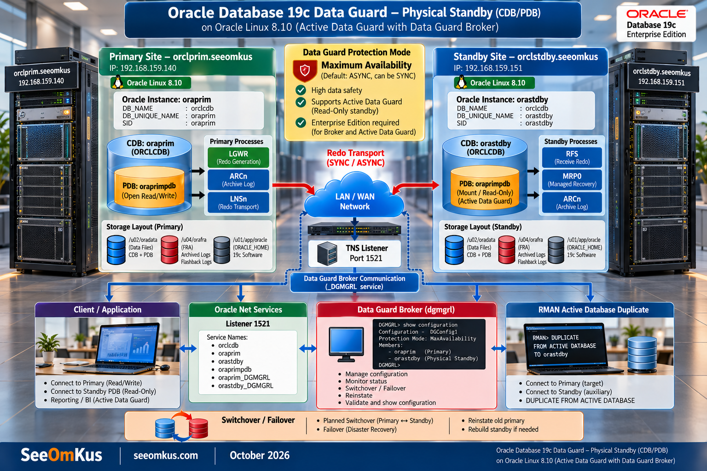

# Oracle Database 19c Data Guard Implementation on Oracle Linux 8.10

End-to-end, step-by-step implementation guide for **Oracle Data Guard (Physical Standby)** between a Primary and a Standby database running **Oracle Database 19c Enterprise Edition** (Container Database with a Pluggable Database) on **Oracle Linux 8.10**.

This guide is written from a real lab build — every command, error, and fix documented here was actually encountered and resolved on live Oracle Linux 8.10 VMs, not just copied from theory.

## What's Covered

- **Architecture & Design** — Multitenant (CDB/PDB) Data Guard topology, protection modes, storage path flexibility, server spec considerations, and same-DC vs. DR-site network requirements.
- **Full Build, Step by Step** — OS preparation, Oracle 19c EE software install, primary database creation, network/listener/TNS setup, standby instance preparation, RMAN `DUPLICATE ... FROM ACTIVE DATABASE`, Data Guard Broker configuration, and end-to-end validation.
- **Operational Procedures** — Planned switchover/failover, planned server shutdown/startup (correct order), and unplanned outage recovery (server crash scenarios: standby-only, primary-only, or both at once).
- **Monitoring, Backup & Reporting** — Health check queries, alerting thresholds, RMAN backup strategy for a Data Guard environment, and ready-to-use daily/periodic report templates.
- **Troubleshooting Guide** — A detailed symptom → cause → resolution table built from real errors hit during this build (stale LGWR mount ID, stuck standby redo logs, Broker `ORA-16xxx` errors, listener static service registration, and more), including a step-by-step recovery recipe for the most common recurring issue.

## Lab Environment

| Parameter | Primary | Standby |
|---|---|---|
| Hostname | `orclprim.seeomkus` | `orclstdby.seeomkus` |
| Instance / `DB_UNIQUE_NAME` | `oraprim` | `orastdby` |
| CDB Name | `orclcdb` | `orclcdb` |
| PDB Name | `oraprimpdb` | `oraprimpdb` (inherited via duplication) |
| OS | Oracle Linux 8.10 | Oracle Linux 8.10 |
| Database | Oracle Database 19c Enterprise Edition | Oracle Database 19c Enterprise Edition |
| Protection Mode | Maximum Availability (SYNC) | — |

Full environment details, storage layout, and network topology are documented in the guide itself.

## Contents

| File | Description |
|---|---|
| [`oracle-19c-dataguard-ol8-implementation-guide-seeomkus.md`](oracle-19c-dataguard-ol8-implementation-guide-seeomkus.md) | The complete implementation guide (Markdown, with Mermaid diagrams) |
| `oracle-data-guard-architecture-infographic-seeomkus-landscape.png` | Architecture infographic (landscape) |
| `oracle-data-guard-architecture-infographic-seeomkus-portrait.png` | Architecture infographic (portrait) |

## How to Use

1. Open [`oracle-19c-dataguard-ol8-implementation-guide-seeomkus.md`](oracle-19c-dataguard-ol8-implementation-guide-seeomkus.md) — it renders with a full table of contents and Mermaid diagrams directly on GitHub.
2. Start from **Step 3 — Primary Database Preparation** if your servers already have Oracle 19c EE installed as software-only (Steps 1–2 are kept as reference-only background material).
3. Follow the steps in order. Each step includes the exact commands used, plus callouts for pitfalls that were actually hit during this build.
4. Substitute the placeholder password (`Oracle_19c#Pwd`) with your own throughout — see the note in Step 3.1 regarding Oracle's password complexity requirements.

## Document Info

| | |
|---|---|
| **Author** | Kusnandar Rohim — Database Administrator |
| **Organization** | SeeOmKus — [seeomkus.com](https://seeomkus.com) |
| **Classification** | Internal — Lab / Test Environment Documentation |
| **Database Version** | Oracle Database 19c Enterprise Edition |
| **OS** | Oracle Linux Server 8.10 |

---

*This repository documents a lab/test environment. Review and adjust sizing, security, and production-readiness recommendations (see the guide's "Design Considerations" section) before applying any of this to a production system.*
