**SeeOmKus** — [seeomkus.com](https://seeomkus.com)

# Oracle Database 19c Data Guard Implementation on Oracle Linux 8.10

## Implementation & Operations Guide

*Oracle Data Guard — Physical Standby Configuration, Primary `oraprim` / Standby `orastdby`, PDB `oraprimpdb`*

| | |
|---|---|
| **Document Version** | 1.0.0 |
| **Date** | 2026-10-02 |
| **Author** | Kusnandar Rohim — Database Administrator |
| **Organization** | SeeOmKus — [seeomkus.com](https://seeomkus.com) |
| **Database** | Oracle Database 19c — CDB `oraprim` / `orastdby`, PDB `oraprimpdb` |
| **Classification** | Internal — Lab / Test Environment Documentation |

---

End-to-end, step-by-step guide for implementing **Oracle Data Guard (Physical Standby)** between a Primary and a Standby database running **Oracle Database 19c Enterprise Edition (Container Database with a Pluggable Database)** on **Oracle Linux 8.10 (OL8.10)**.

> **Edition requirement:** Data Guard Broker (`dgmgrl`) and Active Data Guard require **Oracle Database Enterprise Edition (EE)**. Standard Edition 2 (SE2) does **not** support the Broker (`ORA-00439: feature not enabled: Data Guard Broker`) — basic manual physical standby (redo transport + managed recovery without Broker) is possible on SE2, but this guide assumes **EE** throughout so the full Broker-based workflow (Step 7 onward) can be used.

---

## Table of Contents

1. [Architecture Overview](#1-architecture-overview)
2. [Prerequisites](#2-prerequisites)
3. [Environment Layout](#3-environment-layout)
4. [Design Considerations: Storage Paths, Server Specs & Network Topology](#design-considerations-storage-paths-server-specs--network-topology)
5. [Starting Point](#starting-point)
6. [Step 1 — OS Preparation (Both Servers) (Reference)](#step-1--os-preparation-both-servers-reference)
7. [Step 2 — Oracle 19c Software Installation (Both Servers) (Reference)](#step-2--oracle-19c-software-installation-both-servers-reference)
8. [Step 3 — Primary Database Preparation](#step-3--primary-database-preparation)
9. [Step 4 — Network Configuration (Listener & TNS)](#step-4--network-configuration-listener--tns)
10. [Step 5 — Standby Instance Preparation](#step-5--standby-instance-preparation)
11. [Step 6 — Duplicate Database Using RMAN](#step-6--duplicate-database-using-rman)
12. [Step 7 — Configure Data Guard Broker](#step-7--configure-data-guard-broker)
13. [Step 8 — Validate and Test Data Guard](#step-8--validate-and-test-data-guard)
14. [Step 9 — Switchover / Failover Procedures](#step-9--switchover--failover-procedures)
15. [Step 10 — Planned Server Shutdown and Startup Procedure](#step-10--planned-server-shutdown-and-startup-procedure)
16. [Step 11 — Unplanned Outage Recovery (Server Crash)](#step-11--unplanned-outage-recovery-server-crash)
17. [Step 12 — Monitoring and Maintenance](#step-12--monitoring-and-maintenance)
18. [Step 13 — Backup Strategy](#step-13--backup-strategy)
19. [Step 14 — Maintenance & Monitoring Report Format](#step-14--maintenance--monitoring-report-format)
20. [Troubleshooting Guide](#troubleshooting-guide)
21. [Appendix — Useful Reference Scripts](#appendix--useful-reference-scripts)

---

## 1. Architecture Overview

Data Guard maintains one or more **standby databases** as synchronized copies of a **primary database** for disaster recovery, high availability, and read-only reporting (Active Data Guard). This environment uses the **Multitenant architecture**: each server runs a Container Database (CDB) instance, and the primary CDB hosts one Pluggable Database (PDB), `ORAPRIMPDB`, which is replicated to the standby as part of the CDB.

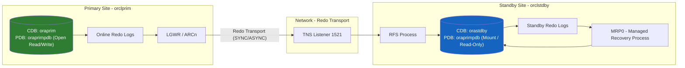

> **Note on PDB naming:** Physical standby is a block-for-block copy of the primary. The PDB inside the standby CDB keeps the **same PDB name** as the primary (`oraprimpdb`) — it does not get renamed to `orastdbypdb`, even though the standby instance itself is named `orastdby`. Only the CDB-level `db_unique_name` (`oraprim` vs `orastdby`) differs between the two sites.

### Data Guard Protection Modes

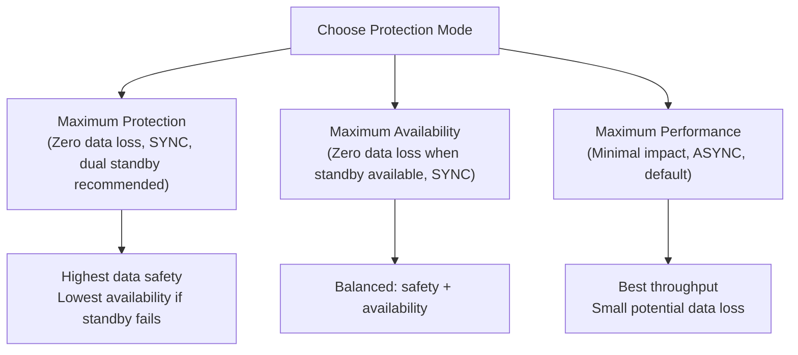

This guide implements **Maximum Availability** mode using **Active Data Guard** with **ASYNC** transport (adjustable to SYNC), which is the most common production configuration.

---

## 2. Prerequisites

| Requirement | Detail |
|---|---|
| OS | Oracle Linux 8.10 (x86_64) on both nodes |
| Database Software | Oracle Database 19c **Enterprise Edition** (19.3 base + latest RU recommended, e.g. 19.24 or later) — required for Data Guard Broker and Active Data Guard |
| CPU | Production: 2+ vCPU recommended. **This lab environment: 1 socket / 2 vCPU per VM** (sufficient for a single-instance test database, not for heavy load) |
| Memory | Production: Minimum 8 GB RAM (16 GB recommended) per node. **This lab environment: 4 GB RAM per VM** — workable for a small test database; see sizing notes below |
| Disk | Minimum 60 GB for ORACLE_HOME + datafiles (size per your DB) |
| Network | Static IP, DNS or `/etc/hosts` resolution between both nodes, low-latency link |
| Swap | Minimum 16 GB or per Oracle sizing formula. **With only 4 GB RAM, configure swap of at least 8–16 GB** to avoid OOM during DBCA/RMAN duplication |
| Kernel Packages | `oracle-database-preinstall-19c` RPM |
| Users | `oracle` OS user, `oinstall`/`dba` groups |
| Ports | 1521 (listener) open between primary and standby |

---

## 3. Environment Layout

This reflects the actual lab environment (`/home/oracle/scripts/setEnv.sh` on each node).

| Parameter | Primary (`orclprim`) | Standby (`orclstdby`) |
|---|---|---|
| Hostname | `orclprim.seeomkus` | `orclstdby.seeomkus` |
| IP Address | `192.168.159.140` | `192.168.159.151` |
| CDB Name (`db_name`) | `orclcdb` | `orclcdb` |
| DB_UNIQUE_NAME (`ORACLE_UNQNAME`) | `oraprim` | `orastdby` |
| Instance Name (`ORACLE_SID`) | `oraprim` | `orastdby` |
| PDB Name | `oraprimpdb` | `oraprimpdb` (inherited from primary via duplication) |
| ORACLE_HOME | `/u01/app/oracle/product/19c/dbhome_1` | `/u01/app/oracle/product/19c/dbhome_1` |
| ORACLE_BASE | `/u01/app/oracle` | `/u01/app/oracle` |
| Data Directory | `/u02/oradata` | `/u02/oradata` |
| Fast Recovery Area | `/u04/orafra` | `/u04/orafra` |
| Listener Port | 1521 | 1521 |
| Role | PRIMARY | PHYSICAL STANDBY |

> **Why `db_name` differs from `db_unique_name`:** `db_name=orclcdb` is the global database name shared by both the primary and its standby copy (they are the *same* database). `db_unique_name` (`oraprim` / `orastdby`) uniquely identifies each site in the Data Guard configuration — this is standard Oracle practice and matches the `ORACLE_UNQNAME` already defined in the environment scripts.

---

## Design Considerations: Storage Paths, Server Specs & Network Topology

These are common real-world questions when planning a Data Guard rollout beyond a single lab pair. They do not change the step-by-step procedure in this guide, but they matter when sizing and placing the actual primary/standby servers.

### Can primary and standby use different storage paths?

**Yes.** The datafile/redo log directory structure does **not** need to match between primary and standby. This guide's own RMAN `DUPLICATE ... NOFILENAMECHECK` with Oracle Managed Files (OMF) already demonstrates this — the standby's actual datafile subdirectories (named by internal GUIDs for each PDB) differ from the primary's even though both share the same `db_create_file_dest=/u02/oradata` base path.

- **`NOFILENAMECHECK`** (used in Step 6) lets RMAN duplicate across differing paths without extra configuration, as long as OMF (`db_create_file_dest`) is in use.
- For non-OMF layouts with genuinely different mount points/paths (e.g. primary on `/u02/oradata`, standby on `/data/oracle`), use **`DB_FILE_NAME_CONVERT`** and **`LOG_FILE_NAME_CONVERT`** so Oracle maps primary paths to standby paths automatically during apply.
- Keep it simple when possible: identical paths reduce operational confusion during switchover/failover (scripts, monitoring, backup tooling reference the same locations regardless of current role), but it is not an Oracle-imposed requirement.

### Can standby hardware be lower-spec than primary?

**Yes, this is common for cost reasons**, but with trade-offs to weigh:

| Must be identical | Can differ |
|---|---|
| Oracle Database **version and patch level (RU)** | CPU core count / clock speed |
| Core OS compatibility for the Oracle binaries | RAM size |
| | Storage type/speed (SSD vs HDD), IOPS capacity |
| | Network interface speed (though this affects transport, see below) |

**Risks of an under-powered standby:**
1. **Apply lag grows** under primary peak load if standby I/O/CPU can't keep up with incoming redo — this guide's own lab (4 GB RAM / 1.5 GB SGA) hit a milder version of this (standby redo logs got stuck during repeated bounces).
2. **Post-failover performance cliff** — the moment the weaker standby becomes primary, it must absorb full production load immediately.
3. **With SYNC transport (MaxAvailability/MaxProtection), a slow standby can throttle the primary** — LGWR waits for the standby's affirm before completing each commit.

**Rule of thumb:** `MaxPerformance` (ASYNC) tolerates a weaker standby reasonably well (monitor apply lag); `MaxAvailability`/`MaxProtection` (SYNC) should have near-equal specs, especially matched storage I/O, or primary performance suffers.

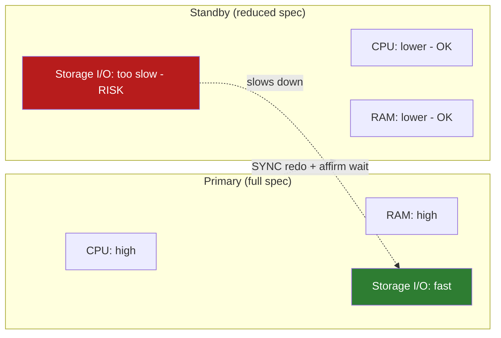

### Network requirements: same Data Center vs. a separate DRC site

**Same Data Center (Primary and Standby co-located):**

| Aspect | Minimum | Recommended |
|---|---|---|
| Round-trip latency | < 2 ms | < 1 ms (same LAN/rack or inter-rack within DC) |
| Bandwidth | ≥ peak redo generation rate × 1.5 | ≥ peak redo rate × 2, dedicated link/VLAN |
| Protection mode | MaxPerformance workable | **MaxAvailability/MaxProtection (SYNC) safe** — low latency barely affects commit time |

**Separate DRC site, ~50 km apart (fiber link):**

| Aspect | Guidance |
|---|---|
| Theoretical latency | ~0.25–0.5 ms one-way at light speed in fiber per 50 km, but **real-world RTT is usually 1–5 ms** due to routing/switching overhead — always measure the actual link, never assume from geographic distance alone |
| Bandwidth | Same formula (≥ peak redo rate × safety factor), but size it from **actual historical peak redo rate** (`v$archived_log` history) since inter-DC links are costlier |
| Protection mode decision | See table below |
| Redundancy | Prefer **two physically diverse network paths** between DC and DRC — a single fiber cut should not take down the whole Data Guard link |
| Resilience tuning | Tune Broker's `NetTimeout` / `ReopenSecs` properties so the primary doesn't stall indefinitely if the DRC link drops while in SYNC mode |

**Protection mode vs. RTT (general guidance, not just for 50 km):**

| Measured RTT | Recommended Mode | Rationale |
|---|---|---|
| < 5 ms | SYNC (MaxAvailability) still viable | Minimal added commit latency on primary |
| 5–20 ms | SYNC possible but test carefully | Noticeable commit latency; validate against application SLA |
| > 20 ms | ASYNC (MaxPerformance) required | SYNC would materially slow down the primary |

> For a well-built 50 km dark-fiber or dedicated metro link, RTT is very often still under 5 ms — SYNC (MaxAvailability, as configured in this guide) is usually fine. But **measure the real link** (e.g. `ping`, or redo transport lag under load) before committing to SYNC in production; don't rely on the 50 km figure alone.

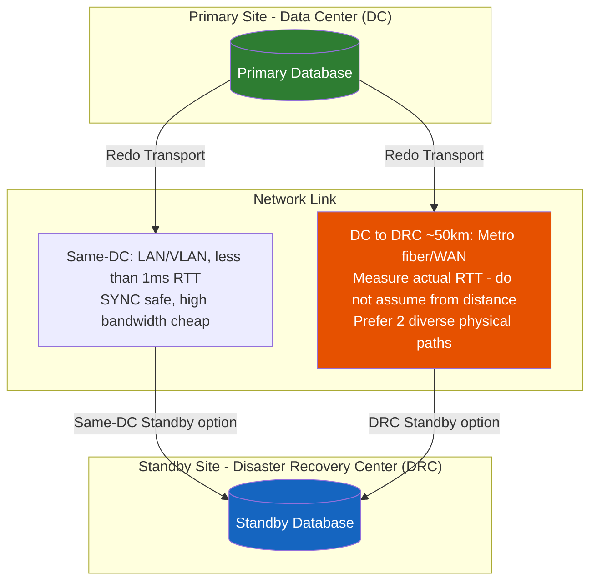

---

## Starting Point

This guide's hands-on execution **begins at Step 3**. Steps 1 and 2 below (OS preparation and Oracle 19c EE software installation) are kept as **reference/background documentation** — in this lab, both `orclprim` and `orclstdby` already had Oracle Database 19c **Enterprise Edition** installed as **software-only** (no database created yet) before execution started. If you are setting up brand-new servers, follow Steps 1–2 first; if your servers are already at this software-only EE state, skip directly to **Step 3 — Primary Database Preparation**.

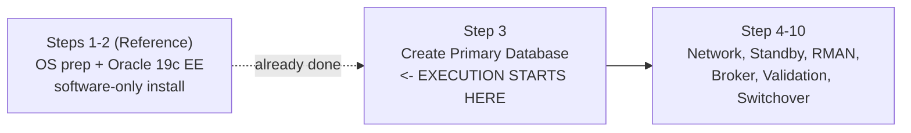

---

## Step 1 — OS Preparation (Both Servers) *(Reference)*

Run identically on **both** `orclprim` and `orclstdby`, adjusting the hostname/IP per node.

### 1.1 Set hostname and `/etc/hosts`

```bash
sudo hostnamectl set-hostname orclprim.seeomkus   # run on primary
sudo hostnamectl set-hostname orclstdby.seeomkus   # run on standby

sudo tee -a /etc/hosts <<EOF
192.168.159.140  orclprim.seeomkus  orclprim
192.168.159.151  orclstdby.seeomkus  orclstdby
EOF
```

### 1.2 Disable SELinux (or set permissive) and firewall for the listener port

```bash
sudo sed -i 's/^SELINUX=.*/SELINUX=permissive/' /etc/selinux/config
sudo setenforce 0

sudo firewall-cmd --permanent --add-port=1521/tcp
sudo firewall-cmd --reload
```

### 1.3 Install prerequisite RPMs

```bash
sudo dnf install -y oracle-database-preinstall-19c
sudo dnf install -y unzip tar wget vim net-tools
```

The `oracle-database-preinstall-19c` package automatically:
- Creates `oracle` user and `oinstall`, `dba`, `oper` groups
- Sets kernel parameters (`/etc/sysctl.d/98-oracle.conf`)
- Sets resource limits (`/etc/security/limits.d/oracle-database-preinstall-19c.conf`)

### 1.4 Set password for `oracle` user

```bash
sudo passwd oracle
```

### 1.5 Create directory structure

```bash
sudo mkdir -p /u01/app/oracle/product/19c/dbhome_1
sudo mkdir -p /u01/app/oraInventory
sudo chown -R oracle:oinstall /u01
sudo chmod -R 775 /u01
```

### 1.6 Configure `oracle` user environment

This environment already uses a shared environment script at `/home/oracle/scripts/setEnv.sh` on each node. Source it (or the equivalent `~/.bash_profile` entries) as follows.

**On Primary (`orclprim`):**

```bash
# /home/oracle/scripts/setEnv.sh
export TMP=/tmp
export TMPDIR=$TMP

export ORACLE_HOSTNAME=orclprim
export ORACLE_UNQNAME=oraprim
export ORACLE_BASE=/u01/app/oracle
export ORACLE_HOME=$ORACLE_BASE/product/19c/dbhome_1
export ORA_INVENTORY=/u01/app/oraInventory
export ORACLE_SID=oraprim
export PDB_NAME=oraprimpdb
export DATA_DIR=/u02/oradata

export PATH=/usr/sbin:/usr/local/bin:$PATH
export PATH=$ORACLE_HOME/bin:$PATH

export LD_LIBRARY_PATH=$ORACLE_HOME/lib:/lib:/usr/lib
export CLASSPATH=$ORACLE_HOME/jlib:$ORACLE_HOME/rdbms/jlib
```

**On Standby (`orclstdby`):**

```bash
# /home/oracle/scripts/setEnv.sh
export TMP=/tmp
export TMPDIR=$TMP

export ORACLE_HOSTNAME=orclstdby
export ORACLE_UNQNAME=orastdby
export ORACLE_BASE=/u01/app/oracle
export ORACLE_HOME=$ORACLE_BASE/product/19c/dbhome_1
export ORA_INVENTORY=/u01/app/oraInventory
export ORACLE_SID=orastdby
export PDB_NAME=orastdbypdb
export DATA_DIR=/u02/oradata

export PATH=/usr/sbin:/usr/local/bin:$PATH
export PATH=$ORACLE_HOME/bin:$PATH

export LD_LIBRARY_PATH=$ORACLE_HOME/lib:/lib:/usr/lib
export CLASSPATH=$ORACLE_HOME/jlib:$ORACLE_HOME/rdbms/jlib
```

> **Important:** `PDB_NAME=orastdbypdb` in the standby's script is only used if you ever create a **standalone** database on that node. For the Data Guard build in this guide, the standby's PDB is **not** created separately — it arrives automatically from the primary during RMAN duplication and keeps the name `oraprimpdb`. Ignore `PDB_NAME` on the standby side from Step 3 onward.

Load the environment before running any Oracle utility:

```bash
source /home/oracle/scripts/setEnv.sh
```

### 1.7 Disk / Storage Layout

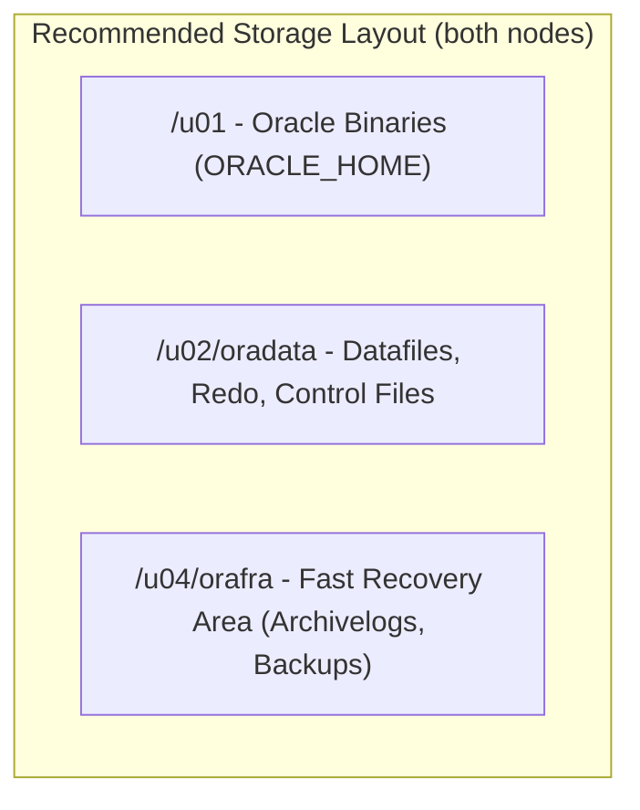

```bash
sudo mkdir -p /u02/oradata /u04/orafra
sudo chown -R oracle:oinstall /u02 /u04
```

---

## Step 2 — Oracle 19c Software Installation (Both Servers) *(Reference)*

### 2.1 Download and stage software

Download `LINUX.X64_193000_db_home.zip` from Oracle Software Delivery Cloud (or your internal repository) to both nodes.

```bash
su - oracle
source /home/oracle/scripts/setEnv.sh
mkdir -p /u01/stage
cd /u01/stage
# transfer the zip here via scp/sftp
unzip LINUX.X64_193000_db_home.zip -d $ORACLE_HOME
```

### 2.2 Run installer in silent mode (software-only)

```bash
cd $ORACLE_HOME
./runInstaller -silent -waitforcompletion \
  -responseFile $ORACLE_HOME/install/response/db_install.rsp \
  oracle.install.option=INSTALL_DB_SWONLY \
  ORACLE_HOSTNAME=$(hostname -f) \
  UNIX_GROUP_NAME=oinstall \
  INVENTORY_LOCATION=/u01/app/oraInventory \
  SELECTED_LANGUAGES=en \
  ORACLE_HOME=$ORACLE_HOME \
  ORACLE_BASE=$ORACLE_BASE \
  oracle.install.db.InstallEdition=EE \
  oracle.install.db.OSDBA_GROUP=dba \
  oracle.install.db.OSOPER_GROUP=oper \
  oracle.install.db.OSBACKUPDBA_GROUP=dba \
  oracle.install.db.OSDGDBA_GROUP=dba \
  oracle.install.db.OSKMDBA_GROUP=dba \
  oracle.install.db.OSRACDBA_GROUP=dba \
  SECURITY_UPDATES_VIA_MYORACLESUPPORT=false \
  DECLINE_SECURITY_UPDATES=true
```

### 2.3 Run required root scripts (as `root`, on both nodes)

```bash
sudo /u01/app/oraInventory/orainstRoot.sh
sudo $ORACLE_HOME/root.sh
```

### 2.4 Apply latest Release Update (RU) — recommended

```bash
# Example only — always apply matching RU on BOTH primary and standby
cd /u01/stage
unzip p<RU_PATCH_NUMBER>_190000_Linux-x86-64.zip -d /u01/stage/RU
$ORACLE_HOME/OPatch/opatch apply -silent /u01/stage/RU/<patch_dir>
```

> **Important:** Primary and standby must run the **exact same** Oracle version and patch level (Release Update) to avoid redo apply incompatibilities.

> Both servers are currently at **software-only** install (confirmed) — no database exists yet. Continue directly to Step 3 to create the primary database.

---

## Step 3 — Primary Database Preparation

**← Execution starts here.** Both servers are assumed to already have Oracle Database 19c Enterprise Edition installed as software-only. Run entirely on `orclprim`.

### 3.1 Create the primary CDB + PDB with DBCA

> **Memory sizing note for this lab:** the VM has only **4 GB RAM total / 1 socket / 2 vCPU**. Allocating all 4 GB to Oracle (`-totalMemory 4096`) would starve the OS. Use **1536 MB (1.5 GB)** for Oracle SGA+PGA instead, leaving headroom for the OS, listener, and background processes. This is adequate for a small lab/test database — not representative of production sizing.
>
> **`Oracle_19c#Pwd` is a placeholder — substitute your own password everywhere it appears in this guide.** It is used purely so every command stays consistent and copy-pasteable; it is **not** a recommended or guaranteed-valid password. In practice, Oracle's default password complexity check rejected a password of this same shape in this lab with `OPW-00029: Password complexity failed for SYS user`. Pick a password that satisfies your environment's password verify function (typically: 8+ characters, mixed case, at least one digit and one special character, and not a simple dictionary word), and use that **same** password consistently across every `-sysPassword`, `-systemPassword`, `-pdbAdminPassword`, `orapwd`, and `dgmgrl`/`sqlplus` connection string in this guide — all wherever `Oracle_19c#Pwd` appears.

```bash
source /home/oracle/scripts/setEnv.sh

dbca -silent -createDatabase \
  -templateName General_Purpose.dbc \
  -gdbname orclcdb \
  -sid oraprim \
  -dbUniqueName oraprim \
  -createAsContainerDatabase true \
  -numberOfPDBs 1 \
  -pdbName oraprimpdb \
  -pdbAdminPassword Oracle_19c#Pwd \
  -sysPassword Oracle_19c#Pwd \
  -systemPassword Oracle_19c#Pwd \
  -storageType FS \
  -datafileDestination /u02/oradata \
  -recoveryAreaDestination /u04/orafra \
  -recoveryAreaSize 51200 \
  -redoLogFileSize 200 \
  -emConfiguration NONE \
  -characterSet AL32UTF8 \
  -totalMemory 1536
```

### 3.2 Enable ARCHIVELOG mode

```sql
sqlplus / as sysdba

SHUTDOWN IMMEDIATE;
STARTUP MOUNT;
ALTER DATABASE ARCHIVELOG;
ALTER DATABASE OPEN;
ARCHIVE LOG LIST;
```

### 3.3 Enable FORCE LOGGING and configure Fast Recovery Area

```sql
ALTER DATABASE FORCE LOGGING;

ALTER SYSTEM SET db_recovery_file_dest_size=50G SCOPE=BOTH;
ALTER SYSTEM SET db_recovery_file_dest='/u04/orafra' SCOPE=BOTH;
```

### 3.4 Create Standby Redo Logs on Primary

Standby redo logs should exist on **both** primary and standby, sized equal to or larger than online redo logs, with one extra group more than the number of online redo log groups/thread.

```sql
-- Assuming 3 online redo groups of 200M each -> create 4 standby redo groups
ALTER DATABASE ADD STANDBY LOGFILE GROUP 4 ('/u02/oradata/ORAPRIM/redostb01.log') SIZE 200M;
ALTER DATABASE ADD STANDBY LOGFILE GROUP 5 ('/u02/oradata/ORAPRIM/redostb02.log') SIZE 200M;
ALTER DATABASE ADD STANDBY LOGFILE GROUP 6 ('/u02/oradata/ORAPRIM/redostb03.log') SIZE 200M;
ALTER DATABASE ADD STANDBY LOGFILE GROUP 7 ('/u02/oradata/ORAPRIM/redostb04.log') SIZE 200M;
```

> Confirmed actual path: DBCA created datafiles/redo logs under `/u02/oradata/ORAPRIM/` (matching the `db_unique_name`), not `/u02/oradata/ORCLCDB/`.

### 3.5 Set primary Data Guard related initialization parameters

```sql
ALTER SYSTEM SET db_unique_name='oraprim' SCOPE=SPFILE;

ALTER SYSTEM SET log_archive_config='DG_CONFIG=(oraprim,orastdby)' SCOPE=BOTH;
ALTER SYSTEM SET log_archive_dest_1='LOCATION=USE_DB_RECOVERY_FILE_DEST VALID_FOR=(ALL_LOGFILES,ALL_ROLES) DB_UNIQUE_NAME=oraprim' SCOPE=BOTH;
ALTER SYSTEM SET log_archive_dest_2='SERVICE=orastdby ASYNC VALID_FOR=(ONLINE_LOGFILES,PRIMARY_ROLE) DB_UNIQUE_NAME=orastdby' SCOPE=BOTH;
ALTER SYSTEM SET log_archive_dest_state_1=ENABLE SCOPE=BOTH;
ALTER SYSTEM SET log_archive_dest_state_2=ENABLE SCOPE=BOTH;

ALTER SYSTEM SET fal_server='orastdby' SCOPE=BOTH;
ALTER SYSTEM SET log_archive_max_processes=4 SCOPE=BOTH;
ALTER SYSTEM SET log_archive_trace=0 SCOPE=BOTH;
ALTER SYSTEM SET standby_file_management='AUTO' SCOPE=BOTH;
ALTER SYSTEM SET remote_login_passwordfile='EXCLUSIVE' SCOPE=SPFILE;
ALTER SYSTEM SET log_archive_min_succeed_dest=1 SCOPE=BOTH;

ALTER SYSTEM SET db_create_file_dest='/u02/oradata' SCOPE=BOTH;
ALTER SYSTEM SET db_create_online_log_dest_1='/u02/oradata' SCOPE=BOTH;
```

> **Set `log_archive_min_succeed_dest=1` preventively.** If left at its default (2), Data Guard Broker can fail to reassign `log_archive_dest_1`/`log_archive_dest_2` during a **switchover** with `ORA-16028: new LOG_ARCHIVE_DEST_1 causes less destinations than LOG_ARCHIVE_MIN_SUCCEED_DEST requires` — because Broker reconfigures destinations one at a time, and the parameter's own strict requirement can momentarily reject the change. Setting it to `1` avoids this entirely and does not reduce redundancy in this two-destination (local + standby) setup.

Restart the instance to apply any SPFILE-only parameters:

```sql
SHUTDOWN IMMEDIATE;
STARTUP;
```

> **This is the only required primary downtime in the entire procedure.** `db_unique_name` and `remote_login_passwordfile` are `SCOPE=SPFILE`-only parameters, so a restart is unavoidable here. Every other step — including the RMAN duplication in Step 6 — runs against the live, open primary with no further restart needed (barring troubleshooting scenarios; see the Troubleshooting Guide).

### 3.6 Create the password file (if not already created by DBCA) and copy it

```bash
orapwd file=$ORACLE_HOME/dbs/orapworaprim password=Oracle_19c#Pwd force=y
```

> **Naming is case-sensitive on Linux.** The password file must be named exactly `orapw$ORACLE_SID` matching the SID's actual case (here, all lowercase: `orapworaprim`). A file named `orapwOraprim` (capital O) will NOT be recognized for remote SYSDBA authentication and causes `ORA-01017: invalid username/password` on remote connections even with the correct password.

Copy this password file to the standby server (used later, Step 5).

---

## Step 4 — Network Configuration (Listener & TNS)

### 4.1 Configure `listener.ora` (both nodes)

`$ORACLE_HOME/network/admin/listener.ora`

**On Primary (`orclprim`):**

```ini
LISTENER =
  (DESCRIPTION_LIST =
    (DESCRIPTION =
      (ADDRESS = (PROTOCOL = TCP)(HOST = 0.0.0.0)(PORT = 1521))
    )
  )

SID_LIST_LISTENER =
  (SID_LIST =
    (SID_DESC =
      (GLOBAL_DBNAME = orclcdb)
      (ORACLE_HOME = /u01/app/oracle/product/19c/dbhome_1)
      (SID_NAME = oraprim)
    )
    (SID_DESC =
      (GLOBAL_DBNAME = oraprim_DGMGRL)
      (ORACLE_HOME = /u01/app/oracle/product/19c/dbhome_1)
      (SID_NAME = oraprim)
    )
  )

ADR_BASE_LISTENER = /u01/app/oracle
```

> **Required for Data Guard Broker.** The second `SID_DESC` (`GLOBAL_DBNAME = oraprim_DGMGRL`) is a **static service registration** Broker needs to restart this instance during switchover/failover. Without it, `VALIDATE DATABASE` fails with `ORA-12514: TNS:listener does not currently know of service requested` and the configuration reports errors even though redo transport itself may be fine. The naming convention is always `<db_unique_name>_DGMGRL`.

**On Standby (`orclstdby`):**

```ini
LISTENER =
  (DESCRIPTION_LIST =
    (DESCRIPTION =
      (ADDRESS = (PROTOCOL = TCP)(HOST = 0.0.0.0)(PORT = 1521))
    )
  )

SID_LIST_LISTENER =
  (SID_LIST =
    (SID_DESC =
      (GLOBAL_DBNAME = orclcdb)
      (ORACLE_HOME = /u01/app/oracle/product/19c/dbhome_1)
      (SID_NAME = orastdby)
    )
    (SID_DESC =
      (GLOBAL_DBNAME = orastdby_DGMGRL)
      (ORACLE_HOME = /u01/app/oracle/product/19c/dbhome_1)
      (SID_NAME = orastdby)
    )
  )

ADR_BASE_LISTENER = /u01/app/oracle
```

Start the listener (both nodes):

```bash
lsnrctl start
```

### 4.2 Configure `tnsnames.ora` (both nodes — identical entries pointing to each role)

`$ORACLE_HOME/network/admin/tnsnames.ora`

```ini
ORAPRIM =
  (DESCRIPTION =
    (ADDRESS = (PROTOCOL = TCP)(HOST = orclprim.seeomkus)(PORT = 1521))
    (CONNECT_DATA =
      (SERVER = DEDICATED)
      (SID = oraprim)
      (UR = A)
    )
  )

ORASTDBY =
  (DESCRIPTION =
    (ADDRESS = (PROTOCOL = TCP)(HOST = orclstdby.seeomkus)(PORT = 1521))
    (CONNECT_DATA =
      (SERVER = DEDICATED)
      (SID = orastdby)
      (UR = A)
    )
  )
```

> `SID` is used here (not `SERVICE_NAME`) because the standby instance is not open/mounted with active services during NOMOUNT/MOUNT phases — RMAN duplication and Data Guard redo transport require a direct SID connection to reach the instance regardless of its open mode.

### 4.3 Validate TNS connectivity from both sides

```bash
tnsping ORAPRIM
tnsping ORASTDBY

sqlplus sys/Oracle_19c#Pwd@ORAPRIM as sysdba   # from standby node
sqlplus sys/Oracle_19c#Pwd@ORASTDBY as sysdba  # from primary node
```

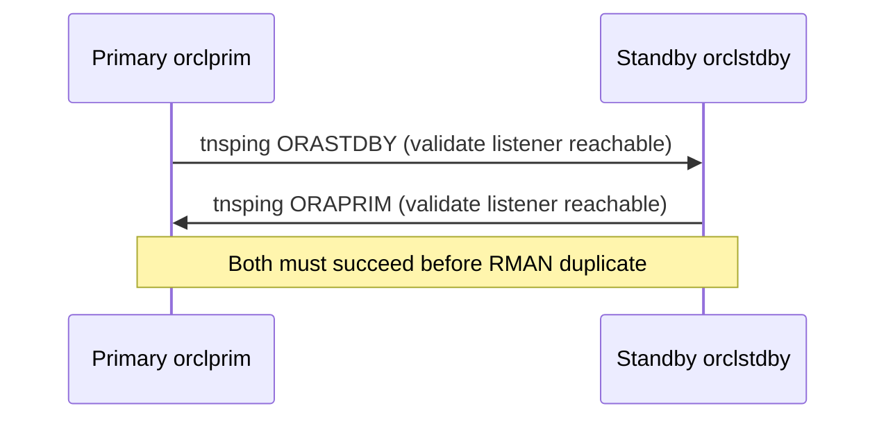

---

## Step 5 — Standby Instance Preparation

Run entirely on `orclstdby`.

### 5.1 Create directory structure on standby (same paths as primary)

```bash
mkdir -p /u02/oradata /u04/orafra
```

### 5.2 Copy password file from primary to standby

```bash
# run on primary
scp $ORACLE_HOME/dbs/orapworaprim oracle@orclstdby:$ORACLE_HOME/dbs/orapworastdby
```

### 5.3 Create a minimal `init.ora` / static parameter file on standby to start a NOMOUNT instance

`$ORACLE_HOME/dbs/initOrastdby.ora`

```ini
db_name=orclcdb
db_unique_name=orastdby
instance_name=orastdby
compatible=19.0.0
control_files='/u02/oradata/ORASTDBY/control01.ctl','/u02/oradata/ORASTDBY/control02.ctl'
db_create_file_dest='/u02/oradata'
db_create_online_log_dest_1='/u02/oradata'
db_recovery_file_dest='/u04/orafra'
db_recovery_file_dest_size=50G
audit_file_dest='/u01/app/oracle/admin/orastdby/adump'
remote_login_passwordfile=EXCLUSIVE
log_archive_config='DG_CONFIG=(oraprim,orastdby)'
log_archive_dest_1='LOCATION=USE_DB_RECOVERY_FILE_DEST VALID_FOR=(ALL_LOGFILES,ALL_ROLES) DB_UNIQUE_NAME=orastdby'
log_archive_dest_2='SERVICE=oraprim ASYNC VALID_FOR=(ONLINE_LOGFILES,PRIMARY_ROLE) DB_UNIQUE_NAME=oraprim'
log_archive_dest_state_1=ENABLE
log_archive_dest_state_2=ENABLE
fal_server='oraprim'
standby_file_management=AUTO
log_archive_min_succeed_dest=1
```

### 5.4 Create required admin directories and start NOMOUNT

```bash
mkdir -p /u01/app/oracle/admin/orastdby/adump

export ORACLE_SID=orastdby
sqlplus / as sysdba <<EOF
STARTUP NOMOUNT PFILE='$ORACLE_HOME/dbs/initOrastdby.ora';
EOF
```

---

## Step 6 — Duplicate Database Using RMAN

This is the core step that copies the primary CDB (including its PDB, `oraprimpdb`) to the standby using **RMAN active database duplication over the network** (no manual backup transfer needed).

> **Zero downtime on the primary — for this step specifically.** `FROM ACTIVE DATABASE` streams datafiles directly from the live, open (`READ WRITE`) primary instance over the network — there is no need to shut down, restart, or place the primary in a restricted state during the duplication itself. The primary continues normal read/write operations throughout. The standby instance (auxiliary), by contrast, must remain in `NOMOUNT` until RMAN completes the duplication.
>
> **This does not mean the entire end-to-end setup is downtime-free.** Elsewhere in this guide the primary *is* restarted — e.g. Step 3.5 (to apply `SCOPE=SPFILE`-only parameters like `db_unique_name` and `remote_login_passwordfile`), and potentially again if a stale LGWR redo-transport session needs to be cleared (see Troubleshooting Guide, `krsj_test_sync: Standby mount ID ... not found`). These restarts are a normal, one-time part of the *initial build*, not of day-to-day operation — once Data Guard is up and stable, routine operation (redo shipping, apply, monitoring, even switchover) does not require shutting the primary down.

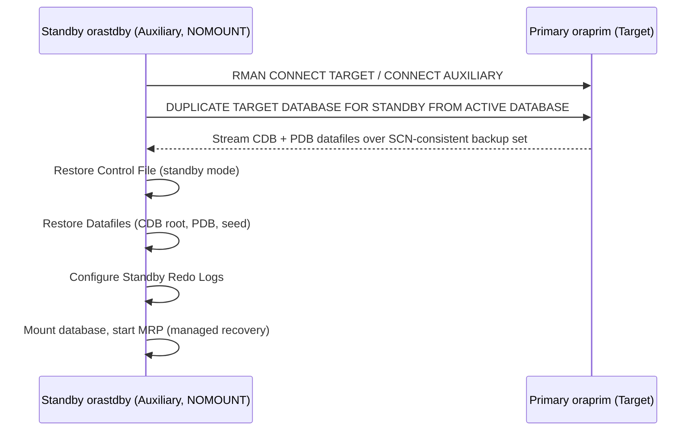

### 6.1 Run RMAN duplicate from the standby node

```bash
export ORACLE_SID=orastdby

rman TARGET sys/Oracle_19c#Pwd@ORAPRIM AUXILIARY sys/Oracle_19c#Pwd@ORASTDBY
```

Inside RMAN:

```sql
RUN {
  ALLOCATE CHANNEL c1 DEVICE TYPE DISK;
  ALLOCATE AUXILIARY CHANNEL aux1 DEVICE TYPE DISK;

  DUPLICATE TARGET DATABASE
    FOR STANDBY
    FROM ACTIVE DATABASE
    DORECOVER
    SPFILE
      SET db_unique_name='orastdby'
      SET fal_server='oraprim'
      SET log_archive_dest_2='SERVICE=oraprim ASYNC VALID_FOR=(ONLINE_LOGFILES,PRIMARY_ROLE) DB_UNIQUE_NAME=oraprim'
      SET control_files='/u02/oradata/ORASTDBY/control01.ctl','/u02/oradata/ORASTDBY/control02.ctl'
      SET db_create_file_dest='/u02/oradata'
      SET db_create_online_log_dest_1='/u02/oradata'
      SET db_recovery_file_dest='/u04/orafra'
      SET audit_file_dest='/u01/app/oracle/admin/orastdby/adump'
      SET instance_name='orastdby'
    NOFILENAMECHECK;
}
```

> RMAN will: connect to primary as TARGET, connect to standby as AUXILIARY, copy CDB root, PDB (`oraprimpdb`), and seed datafiles over the network, create the standby control file, and automatically start Managed Recovery Process (MRP) to begin applying redo. The PDB name remains `oraprimpdb` on the standby — this is expected.
>
> **Important:** the restored SPFILE is a direct copy of the primary's SPFILE, so it still contains the primary's `audit_file_dest` (e.g. `/u01/app/oracle/admin/oraprim/adump`). Without overriding it with `SET audit_file_dest`, the standby instance restart during duplication fails with `ORA-09925: Unable to create audit trail file` because that primary-side path does not exist on the standby server. Always set `audit_file_dest` explicitly to the standby's own admin/adump directory (created in Step 5.4).

### 6.2 Verify the standby database is in managed recovery

```sql
sqlplus / as sysdba

SELECT process, status, sequence# FROM v$managed_standby;
SELECT database_role, open_mode, protection_mode FROM v$database;
SHOW PDBS;
```

If MRP is not started, start it manually:

```sql
ALTER DATABASE RECOVER MANAGED STANDBY DATABASE DISCONNECT FROM SESSION;
```

### 6.3 Open the standby as read-only (Active Data Guard) — standard for this setup

For this implementation, the standby is kept **permanently open read-only** (both the CDB root and the PDB), so client applications can connect to it for reporting/read-only workloads while managed recovery keeps applying redo in real time (Active Data Guard).

```sql
ALTER DATABASE OPEN READ ONLY;
ALTER PLUGGABLE DATABASE ORAPRIMPDB OPEN READ ONLY;

SHOW PDBS;
-- Expect: ORAPRIMPDB  READ ONLY  NO
```

> **Do not run `SAVE STATE` here.** `ALTER PLUGGABLE DATABASE ... SAVE STATE` fails with `ORA-16000: database or pluggable database open for read-only access` once the database is already read-only — `SAVE STATE` requires write access to the data dictionary, which a read-only standby does not have. This is expected; the PDB is still correctly `READ ONLY` as shown by `SHOW PDBS`, it just won't be remembered automatically across the next restart.
>
> **Reopening read-only after a restart is a manual step (or automate it with a trigger).** After any standby instance restart (including after a switchover/failover rebuild in Step 9), both the CDB root and the PDB come back up `MOUNTED`, not read-only — re-run the two `ALTER` commands above each time. To automate this, create a database startup trigger (on the standby instance) that issues `ALTER DATABASE OPEN READ ONLY;` followed by `ALTER PLUGGABLE DATABASE ALL OPEN READ ONLY;` whenever the instance starts in standby role, instead of relying on `SAVE STATE`.

### Client Read-Only Access to the Standby

Add a dedicated TNS alias so applications can connect directly to the standby's PDB for read-only access, without needing to know which node is currently standby:

```ini
ORASTDBY_PDB_RO =
  (DESCRIPTION =
    (ADDRESS = (PROTOCOL = TCP)(HOST = orclstdby.seeomkus)(PORT = 1521))
    (CONNECT_DATA =
      (SERVER = DEDICATED)
      (SERVICE_NAME = oraprimpdb)
    )
  )
```

Applications connect read-only with:

```bash
sqlplus app_user/password@ORASTDBY_PDB_RO
```

Any write attempt against this connection fails with `ORA-16000: database or pluggable database open for read-only access`, which is expected — the standby is intentionally read-only until a switchover/failover promotes it to primary.

---

## Step 7 — Configure Data Guard Broker

Broker simplifies management, monitoring, switchover, and failover.

### 7.1 Enable broker on both instances

**Primary:**

```sql
ALTER SYSTEM SET dg_broker_start=TRUE SCOPE=BOTH;
```

**Standby:**

```sql
ALTER SYSTEM SET dg_broker_start=TRUE SCOPE=BOTH;
```

### 7.2 Create the broker configuration (from primary node)

> **Important — clear manual `LOG_ARCHIVE_DEST_2` first.** Data Guard Broker manages redo transport destinations itself once a database is added to the configuration. If `log_archive_dest_2` (the `SERVICE=...` entry set manually back in Step 3.5 / Step 5.3) is still present, `ADD DATABASE` fails with `ORA-16698: member has a LOG_ARCHIVE_DEST_n parameter with SERVICE attribute set`. Clear it on **both** instances before proceeding:
>
> ```sql
> -- on orclprim
> ALTER SYSTEM SET log_archive_dest_2='' SCOPE=BOTH;
>
> -- on orclstdby
> ALTER SYSTEM SET log_archive_dest_2='' SCOPE=BOTH;
> ```

```bash
dgmgrl sys/Oracle_19c#Pwd@ORAPRIM
```

```sql
CREATE CONFIGURATION 'DGConfig1' AS
  PRIMARY DATABASE IS 'oraprim'
  CONNECT IDENTIFIER IS ORAPRIM;

ADD DATABASE 'orastdby' AS
  CONNECT IDENTIFIER IS ORASTDBY
  MAINTAINED AS PHYSICAL;

ENABLE CONFIGURATION;
```

### 7.3 Verify broker configuration

```sql
SHOW CONFIGURATION;
SHOW DATABASE 'oraprim';
SHOW DATABASE 'orastdby';
```

### 7.4 Set protection mode (Maximum Availability example)

> **Order matters.** Set the redo transport mode to `SYNC` on **both** databases *first* — `MaxAvailability` requires every standby to already be receiving redo synchronously. Doing it the other way around (setting the protection mode before `SYNC` is in place) fails with `ORA-16627: operation disallowed since no member would remain to support protection mode`.

Update redo transport to SYNC on both databases:

```sql
EDIT DATABASE 'oraprim' SET PROPERTY LogXptMode='SYNC';
EDIT DATABASE 'orastdby' SET PROPERTY LogXptMode='SYNC';
```

Then raise the protection mode:

```sql
EDIT CONFIGURATION SET PROTECTION MODE AS MaxAvailability;
```

### Broker Configuration Flow

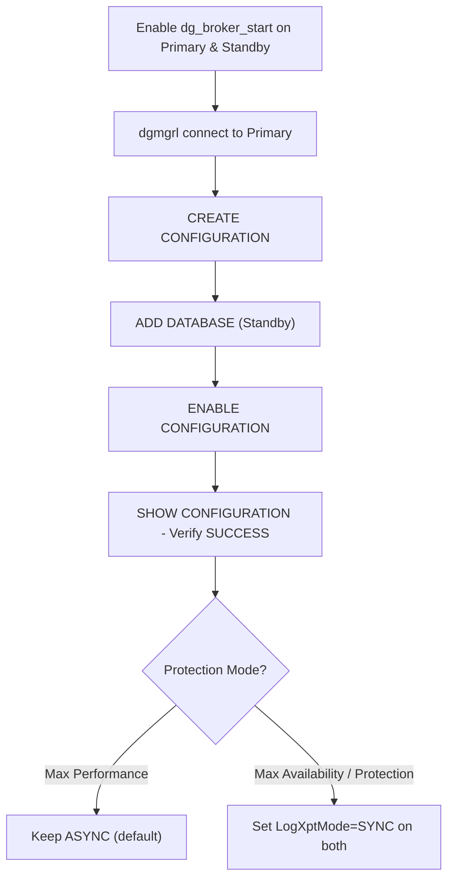

---

## Step 8 — Validate and Test Data Guard

### 8.1 Check overall configuration health

```sql
DGMGRL> SHOW CONFIGURATION;
DGMGRL> SHOW DATABASE VERBOSE 'oraprim';
DGMGRL> SHOW DATABASE VERBOSE 'orastdby';
```

Expected output: `SUCCESS` status, no gaps, apply lag near `00:00:00`.

### 8.2 Check redo transport and apply lag from SQL*Plus (standby)

```sql
SELECT name, value, unit FROM v$dataguard_stats
WHERE name IN ('transport lag','apply lag');

SELECT sequence#, first_time, next_time, applied FROM v$archived_log
ORDER BY sequence# DESC FETCH FIRST 10 ROWS ONLY;
```

### 8.3 Functional test — generate redo on primary and confirm arrival on standby

**On Primary** (connect to the PDB, since that's where application data lives):

```sql
sqlplus / as sysdba

ALTER SESSION SET CONTAINER = oraprimpdb;

CREATE TABLE dg_test_tbl (id NUMBER, ts TIMESTAMP);
INSERT INTO dg_test_tbl VALUES (1, SYSTIMESTAMP);
COMMIT;
ALTER SYSTEM SWITCH LOGFILE;
```

**On Standby (open read-only, Active Data Guard):**

```sql
ALTER DATABASE OPEN READ ONLY;   -- only if not already open

ALTER SESSION SET CONTAINER = oraprimpdb;
SELECT * FROM dg_test_tbl;
```

### 8.4 End-to-end validation flow

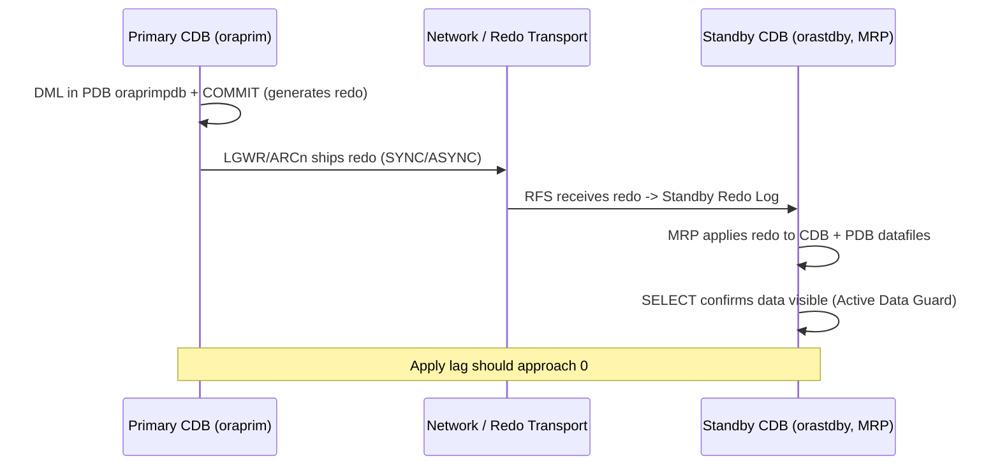

---

## Step 9 — Switchover / Failover Procedures

### 9.1 Planned Switchover (role reversal, no data loss)

> **Pre-check: the standby must be `MOUNTED`, not `OPEN READ ONLY`.** If you followed Step 6.3 and the standby is currently open read-only for Active Data Guard access, close it first — `SWITCHOVER` cannot run against an open database:
> ```sql
> -- on the standby (e.g. orclstdby)
> ALTER PLUGGABLE DATABASE ORAPRIMPDB CLOSE;
> SHUTDOWN IMMEDIATE;
> STARTUP MOUNT;
> ALTER DATABASE RECOVER MANAGED STANDBY DATABASE DISCONNECT FROM SESSION;
> ```
> (A plain `ALTER DATABASE MOUNT STANDBY DATABASE;` from an already-open state fails with `ORA-01154: database busy` — the shutdown/restart above is required.)

```bash
dgmgrl sys/Oracle_19c#Pwd@ORAPRIM
```

```sql
SWITCHOVER TO 'orastdby';
```

Broker automatically:
1. Converts primary to standby role
2. Converts standby to primary role
3. Restarts both instances in their new roles

Verify:

```sql
SHOW CONFIGURATION;
```

> **If this doesn't come back `SUCCESS` immediately, don't panic — a few follow-up fixes are commonly needed right after switchover.** This was observed every time in this lab:
> - **New primary stuck at `ORA-16782: instance not open for read and write access`:** Broker converted its role but the open didn't fully complete. Fix manually:
>   ```sql
>   -- on the new primary
>   ALTER DATABASE OPEN;
>   ALTER PLUGGABLE DATABASE ALL OPEN;
>   ALTER PLUGGABLE DATABASE ORAPRIMPDB SAVE STATE;
>   ```
> - **`ORA-16736`/`ORA-16777: unable to find the destination entry ... in V$ARCHIVE_DEST`:** the new primary hasn't attempted any redo transport yet, so Broker's destination isn't populated. Force one: `ALTER SYSTEM SWITCH LOGFILE;` then recheck `SHOW CONFIGURATION`. If it still shows `log_archive_dest_2` empty (`SHOW PARAMETER log_archive_dest_2`), a full restart of the new primary is usually what resolves it (`SHUTDOWN IMMEDIATE; STARTUP;`).
> - **`log_archive_dest_1` left pointing at the wrong `DB_UNIQUE_NAME`** (e.g. showing the *other* site's name instead of its own) after a partially-failed Broker reconfiguration attempt — causes `ORA-16028` loops. Reset it manually to match the current instance's own `db_unique_name`:
>   ```sql
>   ALTER SYSTEM SET log_archive_dest_1='LOCATION=USE_DB_RECOVERY_FILE_DEST VALID_FOR=(ALL_LOGFILES,ALL_ROLES) DB_UNIQUE_NAME=<this_instances_own_db_unique_name>' SCOPE=BOTH;
>   ```
>
> See the **Troubleshooting Guide** for the full symptom/fix table of these and other switchover-related errors.

### 9.2 Failover (primary is lost / unrecoverable)

> **Testing this in a lab (simulated disaster):** close any open read-only PDB/database on the standby and remount it (same pre-check as 9.1 above), then simulate the primary crashing hard with `SHUTDOWN ABORT` (not `IMMEDIATE` — a real disaster doesn't shut down cleanly) before running the failover command below from the standby side.

```sql
FAILOVER TO 'orastdby';
```

After failover, reinstate the old primary (once it is recoverable) as new standby:

```sql
REINSTATE DATABASE 'oraprim';
```

> **Prerequisite: Flashback Database must already be enabled on the (new) primary.** `REINSTATE DATABASE` works by flashing the old primary back to the SCN where it diverged from the new primary, then converting it to a standby — this is only possible if Flashback Database was turned on **before** the divergence happened. If it was never enabled (as in this lab, where `VALIDATE DATABASE` showed `Flashback Database Status: Off`), reinstate fails with `ORA-16827: Flashback Database is disabled`, and there is no retroactive fix — enabling it now does not help recover the already-diverged database. In that case, skip reinstate and **rebuild the standby from scratch** using the same RMAN `DUPLICATE ... FOR STANDBY FROM ACTIVE DATABASE` procedure from Step 6, with the new primary as the source. To make reinstate available for future failovers, enable Flashback Database proactively on both instances:
> ```sql
> ALTER SYSTEM SET db_recovery_file_dest_size=50G SCOPE=BOTH;  -- if not already set
> ALTER DATABASE FLASHBACK ON;
> ```

### 9.3 Rebuilding the Standby After a Failed Reinstate

When `REINSTATE DATABASE` cannot be used (Flashback Database was off), rebuild the old primary as a fresh standby using RMAN, same approach as Step 6 but with the roles reversed (new primary is now the source).

Following directly from the 9.2 example (`oraprim` was lost, `orastdby` is now the new primary, and `REINSTATE DATABASE 'oraprim'` failed): the goal is to rebuild `oraprim` as the standby, sourced from `orastdby`. **If your actual failover went the opposite direction (as happened during this guide's own lab testing), swap the names below accordingly** — the procedure is identical either way, only the source/target names change.

> **Run the RMAN script from a file, not pasted interactively.** Pasting a multi-line `RUN { ... }` block directly at the `RMAN>` prompt can get split line-by-line by the terminal and fail with `RMAN-01009: syntax error`. Always save it to a `.rman` file and invoke with `cmdfile=`.
>
> **All `SET` clause values inside `DUPLICATE ... SPFILE SET` must be quoted strings** — including numeric-looking ones. `SET log_archive_min_succeed_dest=1` fails with `RMAN-01009: syntax error: found "integer"`; it must be `SET log_archive_min_succeed_dest='1'`.
>
> **Start the auxiliary (standby) instance from a PFILE, not its old SPFILE.** If a leftover `spfileoraprim.ora` from the original build still exists, `STARTUP NOMOUNT` picks it up automatically, and the `DUPLICATE ... SPFILE SET ...` clause (which creates a *new* SPFILE) then fails with `RMAN-05537: DUPLICATE without TARGET connection when auxiliary instance is started with spfile cannot use SPFILE clause`. Rename/remove the old SPFILE first and start explicitly from a PFILE:
> ```bash
> mv $ORACLE_HOME/dbs/spfileoraprim.ora $ORACLE_HOME/dbs/spfileoraprim.ora.bak
> ```
> ```sql
> STARTUP NOMOUNT PFILE='/u01/app/oracle/product/19c/dbhome_1/dbs/initOraprim.ora';
> ```
> (If no such PFILE exists for this instance yet, create a minimal one following the pattern in Step 5.3, substituting `oraprim` for `orastdby` and `orastdby` for `oraprim` throughout.)

**1. Put the standby instance (here, the old primary, `oraprim`) into NOMOUNT** using the PFILE as shown above (do not use a bare `STARTUP NOMOUNT;` if an old SPFILE is present).

**2. Save the duplicate script to a file** (rebuilding `oraprim` as standby from new primary `orastdby`):

```bash
cat > /tmp/dup_standby.rman << 'EOF'
RUN {
  ALLOCATE CHANNEL c1 DEVICE TYPE DISK;
  ALLOCATE AUXILIARY CHANNEL aux1 DEVICE TYPE DISK;

  DUPLICATE TARGET DATABASE
    FOR STANDBY
    FROM ACTIVE DATABASE
    DORECOVER
    SPFILE
      SET db_unique_name='oraprim'
      SET fal_server='orastdby'
      SET log_archive_dest_2='SERVICE=orastdby ASYNC VALID_FOR=(ONLINE_LOGFILES,PRIMARY_ROLE) DB_UNIQUE_NAME=orastdby'
      SET control_files='/u02/oradata/ORAPRIM/control01.ctl','/u02/oradata/ORAPRIM/control02.ctl'
      SET db_create_file_dest='/u02/oradata'
      SET db_create_online_log_dest_1='/u02/oradata'
      SET db_recovery_file_dest='/u04/orafra'
      SET audit_file_dest='/u01/app/oracle/admin/oraprim/adump'
      SET instance_name='oraprim'
      SET log_archive_min_succeed_dest='1'
    NOFILENAMECHECK;
}
EOF
```

**3. Run it** (target is now the new primary `ORASTDBY`, auxiliary is the instance being rebuilt, `ORAPRIM`):

```bash
export ORACLE_SID=oraprim
rman TARGET sys/<password>@ORASTDBY AUXILIARY sys/<password>@ORAPRIM cmdfile=/tmp/dup_standby.rman
```

**4. Re-add to Broker** (the old member was marked `disabled` after failover — downgrade protection mode first if it's `MaxAvailability`/`MaxProtection`, since `REMOVE DATABASE` cannot run otherwise; see Troubleshooting Guide):

```sql
DGMGRL> EDIT CONFIGURATION SET PROTECTION MODE AS MaxPerformance;
DGMGRL> REMOVE DATABASE 'oraprim';
DGMGRL> ADD DATABASE 'oraprim' AS CONNECT IDENTIFIER IS ORAPRIM MAINTAINED AS PHYSICAL;
DGMGRL> ENABLE DATABASE 'oraprim';
DGMGRL> EDIT DATABASE 'oraprim' SET PROPERTY LogXptMode='SYNC';
DGMGRL> EDIT DATABASE 'orastdby' SET PROPERTY LogXptMode='SYNC';
DGMGRL> EDIT CONFIGURATION SET PROTECTION MODE AS MaxAvailability;
DGMGRL> SHOW CONFIGURATION;
```

### Switchover / Failover Decision Flow

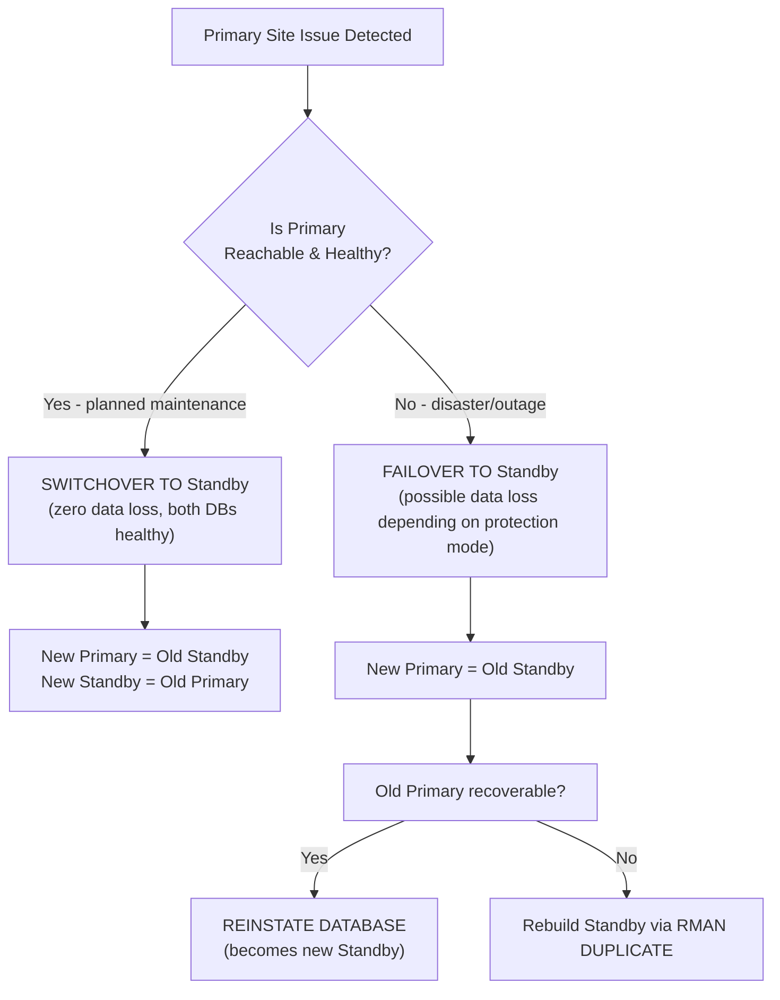

---

## Step 10 — Planned Server Shutdown and Startup Procedure

This covers the OS-level shutdown/restart of the two servers (e.g. for host maintenance, OS patching, planned power-down) — distinct from database-level troubleshooting restarts covered in the Troubleshooting Guide. **Order matters in both directions.**

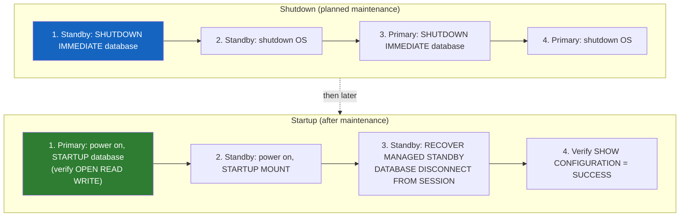

### 10.1 Shutdown Order — Standby First, Then Primary

Shutting down standby first avoids the primary (and Broker/monitoring) flagging the standby as an unexpected failure while it's still in the process of going down.

**1. On the standby** (e.g. `orclstdby`):

```sql
-- optional, if Broker is enabled: tell it this is a planned pause, not a failure
DGMGRL> EDIT DATABASE 'orastdby' SET STATE='APPLY-OFF';
```

```sql
SHUTDOWN IMMEDIATE;
```

```bash
sudo shutdown -h now
```

**2. On the primary** (e.g. `orclprim`), once the standby is confirmed down:

```sql
SHUTDOWN IMMEDIATE;
```

```bash
sudo shutdown -h now
```

> **Do not use `SHUTDOWN ABORT` for planned maintenance.** `SHUTDOWN ABORT` is for emergencies/testing (as used in the Step 9.2 failover drill) — it skips a clean checkpoint and can leave more work for instance recovery on the next startup. For planned shutdowns, always use `SHUTDOWN IMMEDIATE` (or `SHUTDOWN NORMAL` if time allows) so the database closes cleanly first.

### 10.2 Startup Order — Primary First, Then Standby

**1. Power on and start the primary server first.** Once the OS is up:

```sql
STARTUP;
SELECT database_role, open_mode FROM v$database;  -- expect PRIMARY / READ WRITE
SHOW PDBS;  -- confirm PDB(s) reopened (SAVE STATE from Step 3.2/6.3 should handle this)
```

**2. Power on the standby server**, then mount and resume managed recovery:

```sql
STARTUP MOUNT;
ALTER DATABASE RECOVER MANAGED STANDBY DATABASE DISCONNECT FROM SESSION;
```

```sql
-- if Broker was set to APPLY-OFF before shutdown, turn it back on
DGMGRL> EDIT DATABASE 'orastdby' SET STATE='APPLY-ON';
```

**3. If the standby is normally kept open read-only (Active Data Guard, per Step 6.3)**, reopen it:

```sql
ALTER DATABASE OPEN READ ONLY;
ALTER PLUGGABLE DATABASE ORAPRIMPDB OPEN READ ONLY;
```

**4. Verify the configuration is healthy:**

```bash
dgmgrl sys/<password>@ORAPRIM
```

```sql
SHOW CONFIGURATION;  -- expect SUCCESS
SELECT name, value FROM v$dataguard_stats WHERE name IN ('transport lag','apply lag');
```

### 10.3 Important Notes

> **If redo transport doesn't come back `VALID` after startup, this is a known pattern in this environment — see the Troubleshooting Guide.** Specifically the rows on `ORA-16086` / stale LGWR "mount ID" and the **"Recurring SRL-stuck recovery recipe"**: every time the standby instance is bounced (which a full server restart inherently does), the primary may also need a restart to force LGWR to renegotiate its redo transport session. If `SHOW CONFIGURATION` doesn't settle to `SUCCESS` after following 10.1–10.2 above, go to the Troubleshooting Guide's recovery recipe next rather than repeating the startup steps blindly.

> **Server(s) went down without following the 10.1 shutdown order (crash, power loss, VM failure)?** That is not covered by this step — go to **Step 11 — Unplanned Outage Recovery (Server Crash)** instead, which is written specifically for that situation.

---

## Step 11 — Unplanned Outage Recovery (Server Crash)

This step is for when a server goes down **the wrong way** — an OS crash, a hypervisor/VM failure, a power loss, or anything else that skipped a clean `SHUTDOWN IMMEDIATE`. It is different from **Step 10** (planned, clean shutdown/startup in a known order) and different from **Step 9.2 Failover** (primary confirmed permanently lost, standby promoted to replace it for good). Here, the assumption is the opposite: the server(s) can be powered back on, and the goal is to get back to the **original roles** (same primary, same standby) safely.

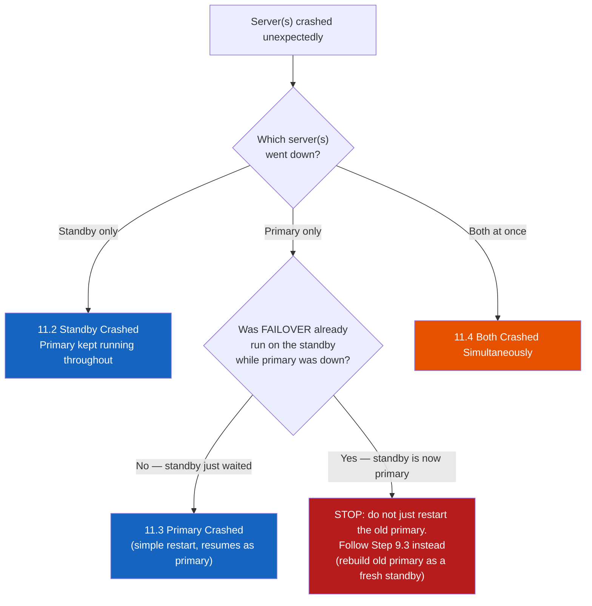

> **First, always ask: did anyone already run `FAILOVER` on the standby while the primary was down?** If yes, the old primary is no longer safe to simply power back on and resume as primary — its redo stream has diverged from the new primary. Treat that case as **Step 9.3 (Rebuilding the Standby After a Failed Reinstate)**, not as a crash recovery. Everything below assumes **no failover was performed** — the outage was short enough that the original primary/standby roles are still intended to stand.

### 11.1 Before Touching the Database: Confirm the OS and Storage Are Sound

Do not rush straight to `STARTUP`. A hard crash can leave the OS or filesystem in a bad state, and starting Oracle against damaged storage makes things worse, not better.

1. Confirm the server actually boots cleanly and the OS reports no filesystem errors (check `dmesg`, `journalctl -xb`, and that `/u02`, `/u04` mounted correctly — `df -h`).
2. Confirm `oracle` OS user, `ORACLE_HOME`, and listener config are all intact (`ls -la /u01/app/oracle/product/19c/dbhome_1` should look normal).
3. Only proceed to the database-level steps below once the OS itself is confirmed healthy.

### 11.2 Standby Server Crashed (Primary Was Running the Whole Time)

This is the simplest case — the primary never stopped, so no redo was lost; the standby only needs to catch back up.

```sql
-- on the standby, after OS is confirmed healthy and listener is started
STARTUP MOUNT;
ALTER DATABASE RECOVER MANAGED STANDBY DATABASE DISCONNECT FROM SESSION;
```

```sql
-- check for any archive log gap accumulated during the outage
SELECT thread#, low_sequence#, high_sequence# FROM v$archive_gap;
```

Oracle's `fal_server`/gap-resolution mechanism normally fetches missing archived logs from the primary automatically once the standby reconnects — no manual intervention needed for the gap itself. If `v$archive_gap` stays non-empty for more than a few minutes, manually verify TNS connectivity (`tnsping`) and `fal_server` before escalating.

> **This is also the exact scenario most likely to hit the stale "mount ID" issue** documented in the Troubleshooting Guide (`ORA-16086`, `krsj_test_sync: Standby mount ID ... not found`) — because the standby came back with a new session but the primary's LGWR may still reference the old one. If `SHOW CONFIGURATION` doesn't reach `SUCCESS` after the standby catches up, restart the **primary** instance next (per the Troubleshooting Guide recipe) rather than repeating standby-side steps.

### 11.3 Primary Server Crashed (No Failover Was Performed)

When the primary server comes back and no one failed over to the standby in the meantime, Oracle handles the hard part automatically: **`STARTUP` performs standard instance crash recovery** (replaying online redo logs to the last committed transaction) the same way any standalone Oracle database recovers from an unclean shutdown. No special Data Guard action is required on the primary itself.

```sql
-- on the primary, after OS is confirmed healthy
STARTUP;
```

```sql
SELECT database_role, open_mode FROM v$database;  -- expect PRIMARY / READ WRITE
SHOW PDBS;  -- confirm PDB(s) reopened (SAVE STATE should handle this automatically)
```

If `STARTUP` reports it needed media recovery (not just instance/crash recovery — e.g. a datafile was offline or inconsistent), **stop and investigate before proceeding** rather than forcing it open; that points to storage-level damage beyond a normal crash.

Once the primary is open, confirm the standby (which was running the whole time) catches up and reconnects cleanly:

```bash
dgmgrl sys/<password>@ORAPRIM
```

```sql
SHOW CONFIGURATION;  -- expect SUCCESS
```

> Same caveat as 11.2 applies here too: if transport doesn't reconnect cleanly, it's usually the stale mount ID pattern — restart the primary once more per the Troubleshooting Guide recipe.

### 11.4 Both Servers Crashed Simultaneously (e.g. Shared Host or Power Failure)

This is the scenario with the highest chance of needing extra recovery steps, since **neither** side shut down cleanly. Follow the same primary-first order as planned startup (Step 10.2), but expect to need the Troubleshooting Guide's recovery recipe along the way — don't be surprised by it.

**1. Power on and start the primary first** (same as 11.3 above — instance crash recovery happens automatically via `STARTUP`):

```sql
STARTUP;
SELECT database_role, open_mode FROM v$database;  -- expect PRIMARY / READ WRITE
```

**2. Power on and mount the standby:**

```sql
STARTUP MOUNT;
ALTER DATABASE RECOVER MANAGED STANDBY DATABASE DISCONNECT FROM SESSION;
```

**3. Check configuration status; if it doesn't settle to `SUCCESS`, go straight to the Troubleshooting Guide's "Recurring SRL-stuck recovery recipe"** rather than guessing — this exact symptom chain (`ORA-16086`, standby redo logs stuck `ACTIVE`, Broker alternating `WARNING`/`ERROR`) is expected after a simultaneous hard crash of both sides in this environment, and that recipe is the proven fix.

```sql
DGMGRL> SHOW CONFIGURATION;
```

**4. If the primary itself failed to open cleanly** (not just a standby-side transport issue — e.g. `STARTUP` reported media recovery was needed, or a datafile/controlfile is reported missing or corrupted): **stop, do not improvise.** This is beyond routine crash recovery — escalate to Oracle Support / restore from the Step 12 backup strategy rather than attempting ad hoc fixes on a primary with potential storage-level corruption.

### 11.5 Post-Recovery Validation Checklist

Run this after **any** of the scenarios above, once `SHOW CONFIGURATION` reports `SUCCESS`:

| Check | Expected Result |
|---|---|
| `SHOW CONFIGURATION` (Broker) | `SUCCESS`, no warnings |
| Transport lag / apply lag (`v$dataguard_stats`) | At or near `0` |
| `v$archive_gap` | No rows |
| Alert log on both nodes, for the outage window | No unexpected `ORA-` errors beyond the crash/restart itself |
| PDB status (`SHOW PDBS`) on primary | `READ WRITE` |
| PDB status on standby (if run read-only per Step 6.3) | `READ ONLY` (reopen manually if not — `SAVE STATE` covers the PDB, not the CDB root, per the Step 6.3 note) |

> **On possible data loss:** this environment runs `MaxAvailability` with `SYNC` transport (Step 7.4), which is designed for zero data loss as long as the primary only ever confirmed a commit after the standby acknowledged it. A primary crash under true `SYNC` should not lose committed transactions. If the protection mode had been temporarily downgraded to `MaxPerformance`/`ASYNC` (e.g. during the Step 9.3 rebuild procedure) and a crash happened before it was raised back to `MaxAvailability`, there is a real possibility that the last few seconds of primary transactions were never shipped to the standby — check the application/business side for any transactions that appear to be missing, and confirm the protection mode is back to `MaxAvailability` going forward.

---

## Step 12 — Monitoring and Maintenance

### 12.1 Key monitoring queries (run on standby)

```sql
-- Apply and transport lag
SELECT name, value, time_computed FROM v$dataguard_stats;

-- Managed recovery process status
SELECT process, status, thread#, sequence#, block# FROM v$managed_standby;

-- Archive log gaps
SELECT thread#, low_sequence#, high_sequence# FROM v$archive_gap;
```

### 12.2 Additional monitoring queries (run on primary and/or standby)

```sql
-- Overall Data Guard protection status (run on primary)
SELECT protection_mode, protection_level, database_role, open_mode, switchover_status
FROM v$database;

-- Redo transport destination health (run on primary)
SELECT dest_id, dest_name, status, type, error FROM v$archive_dest WHERE dest_id <= 2;

-- Recent apply/transport lag history (run on standby)
SELECT name, value, unit, time_computed, datum_time
FROM v$dataguard_stats
WHERE name IN ('transport lag','apply lag','apply finish time','estimated startup time');

-- Fast Recovery Area usage (run on both nodes)
SELECT name, space_limit/1024/1024/1024 AS limit_gb,
       space_used/1024/1024/1024 AS used_gb,
       ROUND(space_used/space_limit*100,1) AS pct_used
FROM v$recovery_file_dest;

-- Standby redo log health (run on standby)
SELECT group#, thread#, sequence#, bytes/1024/1024 AS size_mb, status FROM v$standby_log;

-- Broker configuration + member status in one shot (run via dgmgrl, any node)
-- dgmgrl -silent sys/<password>@ORAPRIM "SHOW CONFIGURATION; SHOW DATABASE VERBOSE 'oraprim'; SHOW DATABASE VERBOSE 'orastdby';"
```

> **Alerting thresholds (suggested starting point — tune to your SLA):**
>
> | Metric | Warning | Critical |
> |---|---|---|
> | Transport lag | > 30 seconds | > 2 minutes |
> | Apply lag | > 1 minute | > 5 minutes |
> | FRA usage (`pct_used` above) | > 70% | > 85% |
> | `v$archive_gap` returns rows | any row | gap older than 1 hour |
> | Broker `SHOW CONFIGURATION` status | `WARNING` | `ERROR` |

### 12.3 Automate health checks

Schedule a cron job on the standby (as `oracle`) to check broker status periodically:

```bash
crontab -e
```

```cron
*/15 * * * * ORACLE_HOME=/u01/app/oracle/product/19c/dbhome_1 ORACLE_SID=orastdby $ORACLE_HOME/bin/dgmgrl -silent sys/Oracle_19c#Pwd@ORAPRIM "SHOW CONFIGURATION" >> /u01/app/oracle/dg_health_check.log 2>&1
```

For stricter alerting, wrap the check in a small script that greps for `SUCCESS` and emails/pages on anything else:

```bash
cat > /home/oracle/scripts/dg_check.sh << 'EOF'
#!/bin/bash
export ORACLE_HOME=/u01/app/oracle/product/19c/dbhome_1
export ORACLE_SID=orastdby
export PATH=$ORACLE_HOME/bin:$PATH

RESULT=$($ORACLE_HOME/bin/dgmgrl -silent sys/Oracle_19c#Pwd@ORAPRIM "SHOW CONFIGURATION")
echo "$RESULT" >> /u01/app/oracle/dg_health_check.log

if ! echo "$RESULT" | grep -q "SUCCESS"; then
  echo "$(date '+%Y-%m-%d %H:%M:%S') ALERT: Data Guard configuration is not SUCCESS" >> /u01/app/oracle/dg_health_check.log
  # Hook in your notification method here (mail, Slack webhook, SNMP trap, etc.)
  # mail -s "Data Guard ALERT on $(hostname)" dba-team@example.com <<< "$RESULT"
fi
EOF
chmod +x /home/oracle/scripts/dg_check.sh
```

```cron
*/5 * * * * /home/oracle/scripts/dg_check.sh
```

### 12.4 Recommended maintenance checklist

| Task | Frequency |
|---|---|
| Check `SHOW CONFIGURATION` for SUCCESS status | Every 5–15 min (automated) |
| Review apply/transport lag | Daily |
| Verify archive log gap resolution | Daily |
| Review FRA space usage on both nodes | Weekly |
| Review standby redo log status (`v$standby_log`) for stuck `ACTIVE` groups | Weekly |
| Validate backups are completing and restorable (see Step 13) | Weekly |
| Test switchover in a DR drill | Quarterly |
| Review and archive/purge old alert logs and trace files | Monthly |
| Apply Oracle patches (RU) to both sites in sync | Per patch cycle |
| Review and update this runbook with any new findings | After every incident/drill |

---

## Step 13 — Backup Strategy

Data Guard and RMAN backups are complementary, not interchangeable: Data Guard protects against **site/hardware failure**, while backups protect against **logical corruption, user error (`DROP TABLE`), and the rare case where both sites are affected**. A production Data Guard setup should always still have a backup strategy.

### 13.1 Where to back up: primary or standby?

**Recommended: back up from the standby**, not the primary. This offloads I/O-intensive backup operations away from the production primary, and is a key operational benefit of running Data Guard in the first place.

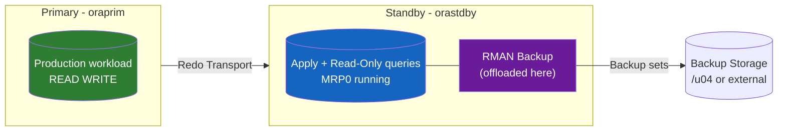

> Backups taken on the standby are fully usable to restore/recover the **primary** too (datafiles are the same database, just a different copy) — RMAN tracks this automatically as long as both instances share the same `DBID` and the backup metadata is accessible (via a shared recovery catalog, or by cataloging the backup against whichever instance performs a restore).

### 13.2 Configure RMAN defaults for a Data Guard environment

Run once per instance (recommended: configure identically on both primary and standby):

```bash
rman TARGET /
```

```sql
-- Delete archived logs only after they've been applied on ALL standby databases
CONFIGURE ARCHIVELOG DELETION POLICY TO APPLIED ON ALL STANDBY;

-- Avoid re-backing-up unchanged datafiles
CONFIGURE BACKUP OPTIMIZATION ON;

-- Retention: keep enough backups to restore within your recovery window
CONFIGURE RETENTION POLICY TO RECOVERY WINDOW OF 7 DAYS;

-- Default backup location (adjust if using a separate backup filesystem/mount)
CONFIGURE CHANNEL DEVICE TYPE DISK FORMAT '/u04/backup/%U';

-- Keep a control file autobackup
CONFIGURE CONTROLFILE AUTOBACKUP ON;

SHOW ALL;
```

> **`ARCHIVELOG DELETION POLICY TO APPLIED ON ALL STANDBY`** is important specifically for Data Guard: it prevents RMAN from deleting an archived log on the standby (or primary) before every standby has actually applied it — avoiding an unrecoverable gap if a log is deleted too early.

### 13.3 Backup script (run on standby)

```bash
cat > /home/oracle/scripts/rman_backup.sh << 'EOF'
#!/bin/bash
export ORACLE_HOME=/u01/app/oracle/product/19c/dbhome_1
export ORACLE_SID=orastdby
export PATH=$ORACLE_HOME/bin:$PATH

LOGFILE=/u01/app/oracle/rman_backup_$(date +%Y%m%d_%H%M%S).log

rman TARGET / LOG=$LOGFILE << RMAN_EOF
RUN {
  ALLOCATE CHANNEL c1 DEVICE TYPE DISK;
  BACKUP AS COMPRESSED BACKUPSET DATABASE PLUS ARCHIVELOG
    TAG 'DAILY_FULL'
    FILESPERSET 4;
  BACKUP CURRENT CONTROLFILE;
  DELETE NOPROMPT OBSOLETE;
  RELEASE CHANNEL c1;
}
RMAN_EOF

grep -E "ORA-|RMAN-0" $LOGFILE && echo "Backup had errors — check $LOGFILE"
EOF
chmod +x /home/oracle/scripts/rman_backup.sh
```

> This backs up the **database** (CDB root + all PDBs) **plus archived logs** in one pass, tagged for easy identification, and cleans up backups/logs that have fallen outside the retention policy (`DELETE NOPROMPT OBSOLETE`).

### 13.4 Schedule the backup

```bash
crontab -e
```

```cron
# Full backup every night at 01:00
0 1 * * * /home/oracle/scripts/rman_backup.sh

# Archived-log-only backup every 4 hours (keeps recovery window tight between full backups)
0 */4 * * * ORACLE_HOME=/u01/app/oracle/product/19c/dbhome_1 ORACLE_SID=orastdby $ORACLE_HOME/bin/rman TARGET / "BACKUP ARCHIVELOG ALL NOT BACKED UP;" >> /u01/app/oracle/rman_archlog_backup.log 2>&1
```

### 13.5 Validate backups are actually restorable

A backup that has never been test-restored is not a backup you can trust. At minimum, quarterly:

```sql
RESTORE DATABASE VALIDATE;
RESTORE ARCHIVELOG ALL VALIDATE;
VALIDATE BACKUPSET <backupset_key>;
```

For a stronger test, periodically do a full **duplicate-to-a-scratch-instance** restore drill (same mechanics as Step 6/9.3) on a throwaway VM, confirming the backup alone — without live redo transport — can actually bring up a working database.

---

## Step 14 — Maintenance & Monitoring Report Format

Keep a consistent reporting format so that health status, incidents, and trends are easy to track over time and easy to hand off between shifts/teams. Two levels are suggested: a quick daily check-in and a more detailed periodic report.

### 14.1 Daily health check report (short form)

Suitable for a daily standup, chat message, or log entry:

```
Data Guard Daily Health Check — <YYYY-MM-DD HH:MM> — Checked by: <name>

Configuration Status   : SUCCESS | WARNING | ERROR
Protection Mode         : MaxAvailability
Primary                 : oraprim  (role: PRIMARY, open_mode: READ WRITE)
Standby                 : orastdby (role: PHYSICAL STANDBY, open_mode: READ ONLY)
Transport Lag           : 0 sec
Apply Lag               : 0 sec
Archive Gap             : None
FRA Usage (Primary)     : 12% of 50 GB
FRA Usage (Standby)     : 14% of 50 GB
Last Successful Backup  : <YYYY-MM-DD HH:MM>, tag DAILY_FULL, no errors
Issues / Actions Taken  : <none, or brief description + resolution>
```

### 14.2 Periodic (weekly/monthly) maintenance report (detailed form)

A more complete template for a weekly or monthly operations report:

| Section | Field | Value / Notes |
|---|---|---|
| **Period** | Report period | `<start date>` – `<end date>` |
| | Prepared by | `<name/role>` |
| **Configuration Health** | Broker Configuration Status (current) | SUCCESS / WARNING / ERROR |
| | Number of WARNING/ERROR incidents this period | `<count>`, with brief description each |
| | Protection Mode | MaxAvailability (unchanged / changed — note why) |
| **Performance** | Average transport lag this period | `<value>` |
| | Average apply lag this period | `<value>` |
| | Peak transport/apply lag observed | `<value>`, timestamp, root cause if known |
| | Redo generation rate (avg / peak) | `<MB/hr avg>` / `<MB/hr peak>` |
| **Storage** | FRA usage — primary | `<% used>`, trend (growing/stable) |
| | FRA usage — standby | `<% used>`, trend |
| | Archive log gap events | `<count>`, resolution time each |
| **Backups** | Backups completed vs scheduled | `<N completed>` / `<N scheduled>` |
| | Backup failures | `<count>`, cause, resolution |
| | Last successful restore validation (`RESTORE ... VALIDATE`) | `<date>` |
| | Last full duplicate/restore drill | `<date>`, result |
| **Maintenance Performed** | Patches/RU applied | `<version>`, date, both sites in sync? Y/N |
| | Switchover/failover drills conducted | `<date>`, result, issues found |
| | Configuration changes made | `<list, with reference to this guide's relevant step>` |
| **Open Items / Risks** | Outstanding issues | `<description, owner, target date>` |
| | Capacity concerns (storage, network, CPU/RAM headroom) | `<description>` |
| **Sign-off** | Reviewed by | `<name>` |
| | Next review date | `<date>` |

> Keep both report levels short and factual — the goal is a fast, repeatable snapshot that makes trends (growing lag, recurring errors, shrinking FRA headroom) visible over time, not a narrative document. Store completed reports (e.g. as dated files or in a shared tracker) so year-over-year/quarter-over-quarter comparisons are possible during audits or capacity planning.

---

## Troubleshooting Guide

| Symptom | Likely Cause | Resolution |
|---|---|---|
| `ORA-16820: fast-start failover observer is no longer observing this database` | Observer not configured/running | Start Fast-Start Failover observer with `dgmgrl` `START OBSERVER` |
| Standby not receiving redo | Listener/TNS/firewall issue | Verify `tnsping`, port 1521 open, `log_archive_dest_2` status |
| `FAL[client]` errors in alert log | `fal_server` misconfigured | Verify `fal_server` parameter points to correct TNS alias |
| Apply lag growing continuously | MRP stopped or I/O bottleneck on standby | `ALTER DATABASE RECOVER MANAGED STANDBY DATABASE DISCONNECT;` and check disk I/O |
| `ORA-16191: Primary log shipping client not logged on standby` | Password file mismatch | Recopy password file from primary to standby |
| Gap sequence not resolving | Archive log deleted before shipped | Restore missing archivelog from primary backup/FRA |
| `SHOW CONFIGURATION` shows ERROR | Broker config out of sync | `DGMGRL> SHOW DATABASE VERBOSE '<db>'` to inspect detailed error |
| PDB not visible on standby (`SHOW PDBS` empty) | Duplication did not complete or MRP not applying | Check `v$managed_standby` and alert log; ensure `standby_file_management=AUTO` |
| `ADD DATABASE` fails with `ORA-16698: member has a LOG_ARCHIVE_DEST_n parameter with SERVICE attribute set` | Manual `log_archive_dest_2` still set before adding to Broker | Clear it first: `ALTER SYSTEM SET log_archive_dest_2='' SCOPE=BOTH;` on both instances, then retry `ADD DATABASE` |
| `VALIDATE DATABASE` fails with `ORA-12514: TNS:listener does not currently know of service requested` (`..._DGMGRL` service) | Missing static service registration in `listener.ora` | Add a `SID_DESC` with `GLOBAL_DBNAME=<db_unique_name>_DGMGRL` pointing to the same `SID_NAME`, then `lsnrctl reload` (see Step 4.1) |
| Persistent `ORA-16086: Redo data cannot be written to the standby redo log` even though standby redo logs show `UNASSIGNED`, and LGWR trace shows `krsj_test_sync: Standby mount ID ... not found` | Primary's LGWR process cached a stale "mount ID" for the standby from before a `CLEAR LOGFILE` (or similar reset) operation on the standby, and never re-established the transport session | **Restart the primary instance** (`SHUTDOWN IMMEDIATE; STARTUP;`) to force LGWR to restart and negotiate a fresh session/mount ID with the standby. Verify with `SELECT dest_id, status, error FROM v$archive_dest WHERE dest_id=2;` (expect `VALID`) |
| All standby redo log groups stuck in `ACTIVE` status forever (never cycle back to `UNASSIGNED`), causing `ORA-16086` | Interrupted/retried redo transport (e.g. from a stale TNS resolution issue), or — observed repeatedly in this resource-constrained lab (4 GB RAM / 1.5 GB SGA) — simply bouncing the standby instance (e.g. before a switchover) | See **"Recurring SRL-stuck recovery recipe"** immediately below. |
| `ALTER DATABASE MOUNT STANDBY DATABASE` fails with `ORA-01154: database busy` (or `ORA-65040` if run from inside a PDB) | Trying to mount while the database is still open (e.g. open read-only for Active Data Guard) | `ALTER PLUGGABLE DATABASE <pdb> CLOSE;` then `SHUTDOWN IMMEDIATE; STARTUP MOUNT;` from the CDB root — a plain mount/close cannot transition directly from OPEN |
| After `SWITCHOVER`, new primary shows `ORA-16782: instance not open for read and write access` | Broker completed the role conversion but the final `OPEN` step did not fully apply (observed in this lab after every switchover) | Manually run `ALTER DATABASE OPEN;` then `ALTER PLUGGABLE DATABASE ALL OPEN;` on the new primary, then `ALTER PLUGGABLE DATABASE <pdb> SAVE STATE;` |
| After `SWITCHOVER`, `SHOW DATABASE VERBOSE` on the new primary shows `ORA-16736`/`ORA-16777: unable to find the destination entry ... in V$ARCHIVE_DEST`, and `SHOW PARAMETER log_archive_dest_2` is empty | The new primary hasn't attempted any redo transport yet, so Broker never populated the destination; in some cases Broker's attempt to repurpose `log_archive_dest_1` also fails outright | Force a transport attempt with `ALTER SYSTEM SWITCH LOGFILE;`. If `log_archive_dest_2` is still empty afterward, fully restart the new primary (`SHUTDOWN IMMEDIATE; STARTUP;`) |
| `ORA-16028: new LOG_ARCHIVE_DEST_1 causes less destinations than LOG_ARCHIVE_MIN_SUCCEED_DEST requires` during/after switchover, and `log_archive_dest_1` is found pointing at the **wrong** `DB_UNIQUE_NAME` (the other site's, not its own) | A partially-failed Broker attempt to reassign `log_archive_dest_1` left it in an inconsistent state | Manually reset it: `ALTER SYSTEM SET log_archive_dest_1='LOCATION=USE_DB_RECOVERY_FILE_DEST VALID_FOR=(ALL_LOGFILES,ALL_ROLES) DB_UNIQUE_NAME=<this instance's own db_unique_name>' SCOPE=BOTH;`, then retry setting `log_archive_min_succeed_dest` if needed |
| `ALTER SYSTEM SET log_archive_min_succeed_dest=1` itself fails with `ORA-16020: fewer destinations available than specified by LOG_ARCHIVE_MIN_SUCCEED_DEST` | Chicken-and-egg: lowering the parameter still requires at least that many *currently valid* destinations, and `log_archive_dest_1` is presently invalid (see row above) | Fix `log_archive_dest_1` first (see row above), confirm `SELECT dest_id, status, error FROM v$archive_dest WHERE dest_id=1;` shows `VALID`, then retry the `log_archive_min_succeed_dest` change |
| `REMOVE DATABASE '<standby>'` in DGMGRL fails with `ORA-16627: operation disallowed since no member would remain to support protection mode` | Protection mode is `MaxAvailability`/`MaxProtection`, which requires at least one standby to always be present | Temporarily downgrade first: `EDIT CONFIGURATION SET PROTECTION MODE AS MaxPerformance;`, do the `REMOVE`/`ADD DATABASE`, then raise it back to `MaxAvailability` afterward (remember to also reset `LogXptMode='SYNC'` on both — downgrading resets it to `ASYNC`) |
| After rebuilding a standby manually via RMAN (bypassing `REINSTATE`), Broker reports `ORA-16795: the standby database needs to be re-created` even though the rebuild succeeded | Broker's internal metadata for that member still references the old (pre-rebuild) incarnation; a manual RMAN rebuild doesn't update Broker's bookkeeping the way `REINSTATE` does | `REMOVE DATABASE '<standby>'` then `ADD DATABASE '<standby>' AS CONNECT IDENTIFIER IS <alias> MAINTAINED AS PHYSICAL;` and `ENABLE DATABASE '<standby>';` to re-register it as a fresh member (see the protection-mode caveat in the row above) |

### Recurring SRL-stuck recovery recipe (observed repeatedly in this lab)

In this lab environment, **every time the standby instance (`orastdby`) is shut down/restarted or re-mounted** (e.g. to prepare for switchover, or after closing a read-only PDB), the following symptom chain tends to recur:

1. All 4 standby redo log groups (4–7) get stuck in `ACTIVE` status and never cycle back to `UNASSIGNED`, even though `MRP0` has already advanced past their sequence numbers.
2. `v$archive_dest` for `dest_id=2` on the primary shows `ERROR` / `ORA-16086: Redo data cannot be written to the standby redo log`.
3. `dgmgrl SHOW CONFIGURATION` alternates between `WARNING` (`ORA-16857`) and `ERROR` (`ORA-16810`).

This is most likely caused by the low-memory lab VM (1 socket / 2 vCPU / 4 GB RAM — see Prerequisites) being too slow to archive/apply standby redo logs before the next bounce, combined with LGWR caching a stale standby "mount ID" across the restart.

**Fix — run in this exact order whenever this happens:**

1. On the **standby** (`orclstdby`): cancel recovery, clear all 4 stuck groups, then restart recovery.
   ```sql
   ALTER DATABASE RECOVER MANAGED STANDBY DATABASE CANCEL;
   ALTER DATABASE CLEAR LOGFILE GROUP 4;
   ALTER DATABASE CLEAR LOGFILE GROUP 5;
   ALTER DATABASE CLEAR LOGFILE GROUP 6;
   ALTER DATABASE CLEAR LOGFILE GROUP 7;
   SELECT group#, sequence#, status FROM v$standby_log;  -- expect all UNASSIGNED
   ALTER DATABASE RECOVER MANAGED STANDBY DATABASE DISCONNECT FROM SESSION;
   ```
2. On the **primary** (`orclprim`): restart the instance to force LGWR to drop the stale mount ID and renegotiate.
   ```sql
   SHUTDOWN IMMEDIATE;
   STARTUP;
   ALTER SYSTEM SWITCH LOGFILE;
   SELECT dest_id, status, error FROM v$archive_dest WHERE dest_id=2;  -- expect VALID
   ```
3. Verify from either node:
   ```bash
   dgmgrl sys/<password>@ORAPRIM
   ```
   ```sql
   SHOW CONFIGURATION;  -- expect SUCCESS
   ```

> **Mitigation for a smoother experience:** this is purely a symptom of the lab's tight resource budget. On a properly-sized Enterprise Edition host (per the production minimums in Prerequisites), this does not recur. If staying on this lab spec, avoid unnecessary standby bounces, and consider adding 2 extra standby redo log groups (6 total) for more buffer.

---

## Appendix — Useful Reference Scripts

### A.1 Quick status one-liner (run on any node)

```bash
dgmgrl -silent sys/Oracle_19c#Pwd@ORAPRIM "SHOW CONFIGURATION"
```

### A.2 Enable Fast-Start Failover (optional, requires Observer)

```sql
DGMGRL> ENABLE FAST_START FAILOVER;
DGMGRL> START OBSERVER;
```

### A.3 Full architecture summary diagram

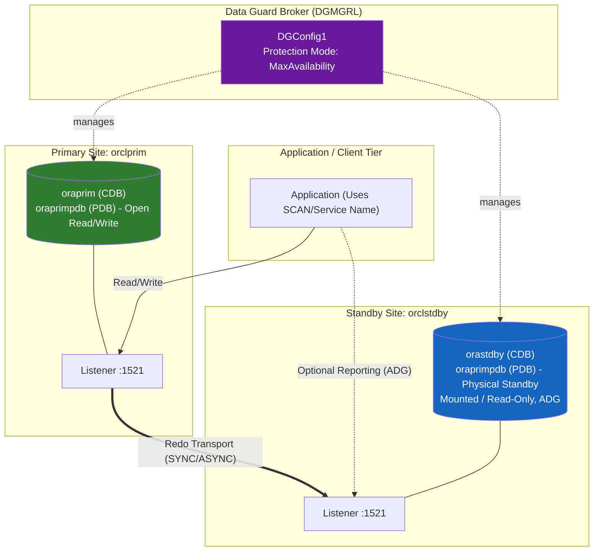

---

## Summary

You have implemented a fully functional **Oracle 19c Data Guard Physical Standby** configuration (Multitenant CDB/PDB) on **Oracle Linux 8.10**, including:

- OS and software preparation on both nodes (`orclprim` / `orclstdby`, `ORACLE_HOME` at `/u01/app/oracle/product/19c/dbhome_1`)
- Primary CDB `oraprim` with PDB `oraprimpdb` configured for Data Guard (ARCHIVELOG, FORCE LOGGING, standby redo logs)
- Network/TNS configuration for redo transport between `oraprim` and `orastdby`
- Standby CDB `orastdby` created via RMAN `DUPLICATE ... FOR STANDBY FROM ACTIVE DATABASE`, inheriting PDB `oraprimpdb`
- Data Guard Broker configuration and protection mode tuning
- Validation, switchover/failover procedures, and ongoing monitoring

This configuration provides disaster recovery and (with Active Data Guard) a read-only reporting standby with minimal data loss exposure.
